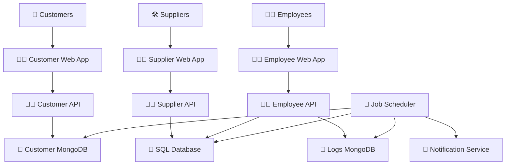

# Project: Astro Bookings System Architecture

> Timestamp: 07/08/2024 10:30

## Software Components

### 🧑‍💻 Web Application

- **Customer Web Application**: UI for customers to view and book seats on space rockets.
  - 🧑‍💻 **Technologies**: Angular, TypeScript, HTML, CSS
  - ⬇️ Consumes `🧑‍💼 Customer API`
  - ⬆️ Provides for `🚀 Customers`
- **Supplier Web Application**: UI for suppliers to manage their rocket launches and bookings.
  - 🧑‍💻 **Technologies**: Angular, TypeScript, HTML, CSS
  - ⬇️ Consumes `🧑‍💼 Supplier API`
  - ⬆️ Provides for `🛠️ Suppliers`
- **Employee Web Application**: UI for employees to manage the overall system and bookings.
  - 🧑‍💻 **Technologies**: React, JavaScript, HTML, CSS
  - ⬇️ Consumes `🧑‍💼 Employee API`
  - ⬆️ Provides for `👨‍💼 Employees`

### 🧑‍💼 API Services

- **Customer API**: Handles customer-related operations.
  - 🧑‍💻 **Technologies**: Node.js, Express, TypeScript
  - ⬇️ Consumes `📇 Customer MongoDB`
  - ⬆️ Provides for `🧑‍💻 Customer Web Application`
- **Supplier API**: Handles supplier-related operations.
  - 🧑‍💻 **Technologies**: Node.js, Express, TypeScript
  - ⬇️ Consumes `📇 SQL Database`
  - ⬆️ Provides for `🧑‍💻 Supplier Web Application`
- **Employee API**: Handles employee-related operations.
  - 🧑‍💻 **Technologies**: Node.js, Express, TypeScript
  - ⬇️ Consumes `📇 SQL Database`, `📇 Logs MongoDB`
  - ⬆️ Provides for `🧑‍💻 Employee Web Application`

### 🗃️ Database Components

- **SQL Database**: Stores supplier and operational data.
  - 🧑‍💻 **Technologies**: PostgreSQL
  - ⬆️ Provides for `🧑‍💼 Supplier API`, `🧑‍💼 Employee API`
- **Customer MongoDB**: Stores customer data.
  - 🧑‍💻 **Technologies**: MongoDB
  - ⬆️ Provides for `🧑‍💼 Customer API`
- **Logs MongoDB**: Stores system logs and user credentials.
  - 🧑‍💻 **Technologies**: MongoDB
  - ⬆️ Provides for `🧑‍💼 Employee API`

### 🔧 External Services

- **Notification Service**: Sends notifications to customers and suppliers.
  - ⬆️ Provides for `🧑‍💼 Job Scheduler`

### 📅 Job Scheduler

- **Job Scheduler**: Manages scheduled tasks such as sending notifications and reconciling databases.
  - 🧑‍💻 **Technologies**: Node.js, Cron
  - ⬇️ Consumes `📇 SQL Database`, `📇 MongoDB`
  - ⬆️ Provides for `🔧 Notification Service`

## System Architecture Diagram

