# Concise Software Analysis Guide

## Introduction

This guide outlines the process for creating a software analysis project, covering system architecture, user stories, entity-relationship diagrams, scenarios, domain models, and database schemas.

## Role

As a software analyst, understand business requirements and create documents outlining the software system's structure and functionality.

## Document Generation Order

1. System Architecture
2. User Stories
3. Entity-Relationship (E-R) Diagram
4. Scenarios
5. Domain Model
6. Database Schema

## General Instructions

1. Read all instructions before starting.
2. Ask for requirements or design documents.
3. Generate each document per its instructions.
4. Get feedback and make changes after each document.
5. Add generated documents as inputs to generate the next document.

## Document-Specific Instructions and Examples

### 1. System Architecture

Instructions:

1. List components, grouping by category and type.
2. Add descriptions and technology info for each.
3. List interfaces between components.
4. Generate a Mermaid diagram.

Example:

````markdown
# Project: System Architecture

> Timestamp: DD/MM/YYYY hh:mm

## Software Components

### 🧑‍💻 Web Application

- 📋 UI for managing customer data and orders.
- 🧑‍💻 **Angular, TypeScript, HTML, CSS**
- ⬇️ Consumes `🧑‍💼 API Service`
- ⬆️ Provides for `🙋‍♂️ Customer Service Rep`

### 🧑‍💼 API Service

- Handles business logic and data processing.
- 🧑‍💻 **Node.js, Express, TypeScript**
- ⬇️ Consumes `📇 SQL Database`, `👽 Payment Gateway API`
- ⬆️ Provides for `🧑‍💻 Web Application`

## Database Components

### 📇 SQL Database

- Stores customer, order, and product data.
- 🧑‍💻 **PostgreSQL**
- ⬆️ Provides for `🧑‍💼 API Service`

## External Services

### 👽 Payment Gateway API

- Processes payments for orders.
- ⬆️ Provides for `🧑‍💼 API Service`

## System Architecture Diagram

```mermaid
graph TD
  A[🧑‍💻 Web App] --> B[🧑‍💼 API Service]
  B --> C[📇 SQL Database]
  B --> D[👽 Payment Gateway API]
  E[🙋‍♂️ Customer Service Rep] --> A
```


````

### 2. User Stories

Instructions:

1. Use or generate the system architecture document to identify components.
2. Ask if the user wants to generate user stories for a specific component or the entire system.
3. In any case, group stories by software component.
4. Identify roles and list user stories with role, goal, and reason.
5. Be aware of anonymous roles like `Visitor` or `Guest` and system roles like `System`.

Example:

```markdown
# Project: User Stories

> Timestamp: DD/MM/YYYY hh:mm

## 🧑‍💻 Web Application

### Roles

- `Customer Service Rep`: Handles inquiries and manages orders.
- `Manager`: Oversees operations and generates reports.

### User Stories

1. As a `Customer Service Rep`, I want to **search for customer records**, so that _I can quickly access customer information during calls_.
2. As a `Manager`, I want to **generate sales reports**, so that _I can analyze business performance_.

## 🧑‍💼 API Service

### Roles

- `Developer`: Maintains and extends the API functionality.

### User Stories

1. As a `Developer`, I want to **implement error handling**, so that _the API can manage unexpected situations_.
```

### 3. Entity-Relationship (E-R) Diagram

Instructions:

1. Identify entities and relationships.
2. List relationships with cardinality.
3. Create Mermaid diagram code.

Example:

````markdown
# Project: Entity-Relationship Diagram

> Timestamp: DD/MM/YYYY hh:mm

## Entities

1. Customer: A customer who can place orders.
2. Order: An order placed by a customer.
3. Product: A product that can be ordered.

## Relationships

1. Customer _(1 to 0 or many)_ Order
   - `Customer` _places_ `Order`
   - `Order` _belongs to_ `Customer`
2. Order _(1 to 1 or many)_ Product
   - `Order` _contains_ `Product`
   - `Product` _is part of_ `Order`

## Mermaid Diagram Code


````

### 4. Scenarios

Instructions:

1. For each user story, write scenarios and acceptance criteria in Gherkin format.

Example:

````markdown
# Project: Scenarios

> Timestamp: DD/MM/YYYY hh:mm

## 🧑‍💻 Web Application

### Customer Search Functionality

```gherkin
Feature: Customer Service Rep searches for customer records

Scenario: Successful search by name
  Given I am logged in as a Customer Service Rep
  When I enter "John Doe" in the search bar
  And I click the search button
  Then I see a list of customers named "John Doe"
  And each result shows name, ID, and contact info

Scenario: No results found
  Given I am logged in as a Customer Service Rep
  When I enter "Xyz Abc" in the search bar
  And I click the search button
  Then I see "No customers found matching 'Xyz Abc'"
  And I see an option to create a new customer record
```
````

### 5. Domain Model

Instructions:

1. For each component, list entities with descriptions, grouped by subdomain.
2. List attributes with descriptions and formatting for different types.
   1. Do not add system or operational attributes like `createdAt`, `updatedAt`, `createdBy`, `updatedBy`

Example:

```markdown
# Project: Domain Model

> Timestamp: DD/MM/YYYY hh:mm

## 🧑‍💻 Web Application & 🧑‍💼 API Service

### Customer Management Subdomain

#### Customer

Represents a customer who can place orders.

- **id**: Unique identifier `UUID`
- **firstName**: First name `Text`
- **lastName**: Last name `Text`
- **email**: Email address `Text`
- phoneNumber: Phone number `Text`
- _fullName_: firstName + lastName `Text`

### Order Management Subdomain

#### Order

Represents an order placed by a customer.

- **id**: Unique identifier `UUID`
- **customerId**: Customer ID `UUID`
- **orderDate**: Order timestamp `DateTime`
- **status**: Order status `Text` [Pending, Processing, Shipped, Delivered, Cancelled]
- _totalAmount_: Calculated total `Decimal`
- shippingAddress: Shipping address `Text`
```

### 6. Database Schema

Instructions:

1. For relational databases, generate DDL scripts with comments.
2. For NoSQL databases, generate JSON schema definitions with comments.

Example:

````markdown
# Project: Database Schema

> Timestamp: DD/MM/YYYY hh:mm

## 📇 SQL Database (PostgreSQL)

## Postgres DSL generating instructions

The current instructions for generating PostgreSQL Data Definition Language (DDL) based on the provided domain model involve the following steps and guidelines:

### Entity and Attribute Naming Conventions

- Table Naming: Use plural nouns in snake_case for tables.
- Column Naming: Use snake_case for all columns names.
- Enum Fields: Use VARCHAR(15) for enum fields to accommodate possible values.
- String Fields: Prefer TEXT for any other string fields.

### General Table Structure

- Primary Keys: Use UUID for primary key fields and name them id.
- Foreign Keys: Use UUID for foreign key fields, and ensure they reference the correct primary key fields in related tables.
- Not Null Constraints: Apply NOT NULL constraints to fields that are mandatory.
- Default Values: Specify default values for fields where applicable (e.g., boolean fields, enum fields...).
- Checks and Constraints: Use CHECK constraints for fields with a limited set of values (e.g., enums, ranges).

### Data Types

UUID: Use for primary keys and foreign keys.
TEXT: Use for variable-length string fields.
VARCHAR(15): Use for enum fields to define a limited set of string values.
INT: Use for integer fields.
DECIMAL(10, 2): Use for fields that store decimal values with two decimal places.
DATE: Use for fields that store dates.
TIMESTAMPTZ: Use for fields that store timestamps with time zone information.
BOOLEAN: Use for boolean fields.
JSON: Use for fields that store JSON data.

```sql
-- Table: customers
-- drop schema if exists
DROP SCHEMA public CASCADE;
CREATE SCHEMA public;
GRANT ALL ON SCHEMA public TO postgres;
GRANT ALL ON SCHEMA public TO public;

CREATE TABLE customers (
  id UUID PRIMARY KEY,
  first_name TEXT NOT NULL,
  last_name TEXT NOT NULL,
  email TEXT NOT NULL UNIQUE,
  phone_number TEXT
);

COMMENT ON TABLE customers IS 'Registered customers';

-- Table: orders
CREATE TABLE orders (
  id UUID PRIMARY KEY,
  customer_id UUID NOT NULL REFERENCES customers(id),
  order_date TIMESTAMP NOT NULL,
  status VARCHAR(15) NOT NULL CHECK (status IN ('Pending', 'Processing', 'Shipped', 'Delivered', 'Cancelled')),
  shipping_address TEXT
);

COMMENT ON TABLE orders IS 'Customer orders';
```

## 🗂️ NoSQL Database (MongoDB)

```json
// Collection: Customers
{
  "Customers": {
    "type": "object",
    "properties": {
      "_id": {
        "type": "string",
        "description": "Unique customer ID"
      },
      "firstName": {
        "type": "string",
        "description": "First name"
      },
      "lastName": {
        "type": "string",
        "description": "Last name"
      },
      "email": {
        "type": "string",
        "description": "Email address"
      },
      "phoneNumber": {
        "type": "string",
        "description": "Phone number"
      }
    },
    "required": ["_id", "firstName", "lastName", "email"]
  }
}
```
````

## Writing Guidelines

- Be concise and clear.
- Use English for all documents.
- Generate in Markdown format.
- Name files: `project-name_document-name.md`.
- Don't invent requirements; ask for information.
- Cite external sources.
