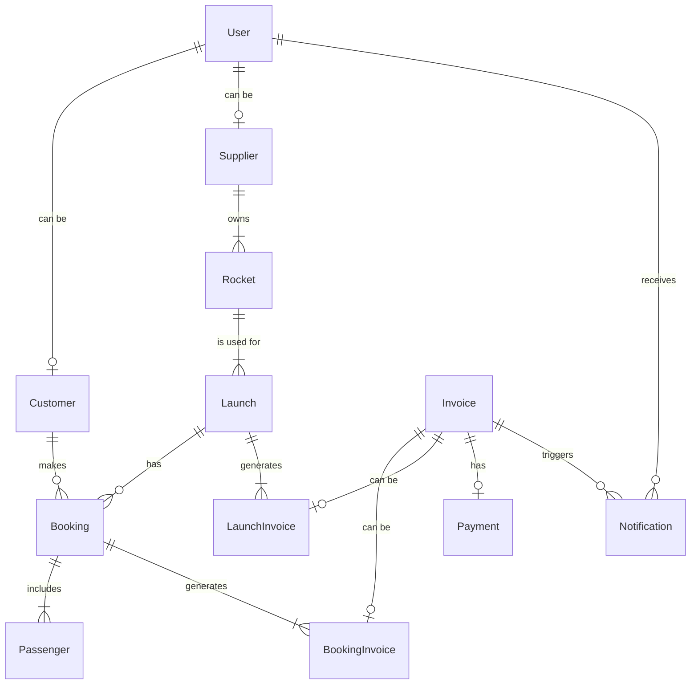

# Astro Bookings: Entity Relationships

> Timestamp: 06/08/2024 12:15

## Entities

### 1. User

A registered individual on the Astro Bookings platform.

### 2. Customer

A user who books space travel.

### 3. Supplier

A company that provides rocket launches.

### 4. Rocket

A spacecraft capable of carrying passengers.

### 5. Launch

A scheduled trip to space using a specific rocket.

### 6. Booking

A reservation made by a customer for a specific launch.

### 7. Passenger

A person who will travel on a booked launch.

### 8. Invoice

A generalized entity for bills, containing common legal information.

### 9. BookingInvoice

A specialized invoice entity for customer bookings, including charges and potential refunds.

### 10. LaunchInvoice

A specialized invoice entity for supplier launches, including charges and potential received invoices.

### 11. Payment

A record of financial transactions related to invoices.

### 12. Notification

A message sent to users about various events in the system.

## Relationships

### 1. User (1 to 0 or 1) Customer

- `User` _can be a_ `Customer`
- `Customer` _is a_ `User`

### 2. User (1 to 0 or 1) Supplier

- `User` _can be a_ `Supplier`
- `Supplier` _is a_ `User`

### 3. Supplier (1 to 1 or many) Rocket

- `Supplier` _owns_ `Rocket`
- `Rocket` _belongs to_ `Supplier`

### 4. Rocket (1 to 1 or many) Launch

- `Rocket` _is used for_ `Launch`
- `Launch` _uses_ `Rocket`

### 5. Launch (1 to 0 or many) Booking

- `Launch` _has_ `Booking`
- `Booking` _is for_ `Launch`

### 6. Customer (1 to 0 or many) Booking

- `Customer` _makes_ `Booking`
- `Booking` _is made by_ `Customer`

### 7. Booking (1 to 1 or many) Passenger

- `Booking` _includes_ `Passenger`
- `Passenger` _is included in_ `Booking`

### 8. Invoice (1 to 0 or 1) BookingInvoice

- `Invoice` _can be a_ `BookingInvoice`
- `BookingInvoice` _is a_ `Invoice`

### 9. Invoice (1 to 0 or 1) LaunchInvoice

- `Invoice` _can be a_ `LaunchInvoice`
- `LaunchInvoice` _is a_ `Invoice`

### 10. Booking (1 to 1 or many) BookingInvoice

- `Booking` _generates_ `BookingInvoice`
- `BookingInvoice` _is generated for_ `Booking`

### 11. Launch (1 to 1 or many) LaunchInvoice

- `Launch` _generates_ `LaunchInvoice`
- `LaunchInvoice` _is generated for_ `Launch`

### 12. Invoice (1 to 0 or 1) Payment

- `Invoice` _has_ `Payment`
- `Payment` _is for_ `Invoice`

### 13. Invoice (1 to 0 or many) Notification

- `Invoice` _triggers_ `Notification`
- `Notification` _is triggered by_ `Invoice`

### 14. User (1 to 0 or many) Notification

- `User` _receives_ `Notification`
- `Notification` _is sent to_ `User`

## Mermaid diagram code

