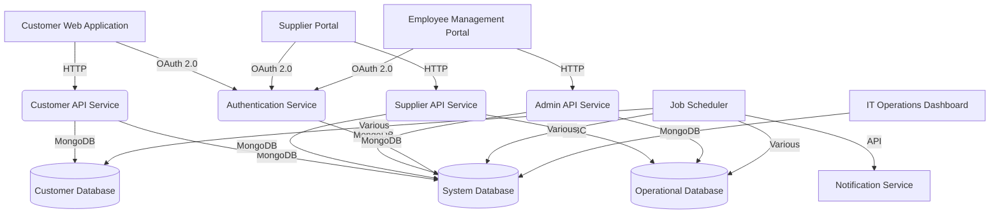

# System Architecture for Astro Bookings

## Components

### Customer-facing Applications
- `Customer Web Application`:
  - Description: Web interface for customers to view launches and make bookings
  - Type: Web application
  - Technology: Angular

### Supplier-facing Applications
- `Supplier Portal`:
  - Description: Web interface for suppliers to manage rockets and launches
  - Type: Web application
  - Technology: Angular

### Employee-facing Applications
- `Employee Management Portal`:
  - Description: Web interface for employees to manage bookings, launches, and financial operations
  - Type: Web application
  - Technology: Angular

### Backend Services
- `Customer API Service`:
  - Description: Handles customer-related operations
  - Type: API Service
  - Technology: NestJS

- `Supplier API Service`:
  - Description: Handles supplier-related operations
  - Type: API Service
  - Technology: NestJS

- `Admin API Service`:
  - Description: Handles administrative operations
  - Type: API Service
  - Technology: NestJS

- `Authentication Service`:
  - Description: Manages user authentication and authorization
  - Type: API Service
  - Technology: NestJS

### Databases
- `Operational Database`:
  - Description: Stores relational data for suppliers and employees
  - Type: Database
  - Technology: PostgreSQL

- `Customer Database`:
  - Description: Stores customer-related data for quick access
  - Type: Database
  - Technology: MongoDB

- `System Database`:
  - Description: Stores system logs, user credentials, and synchronization messages
  - Type: Database
  - Technology: MongoDB

### Background Services
- `Job Scheduler`:
  - Description: Manages scheduled tasks like email notifications and database synchronization
  - Type: Job
  - Technology: Node.js

- `Notification Service`:
  - Description: Handles sending of emails and other notifications
  - Type: External Service
  - Technology: Third-party email service

### Monitoring and Logging
- `IT Operations Dashboard`:
  - Description: Web interface for IT operators to monitor system status and logs
  - Type: Web application
  - Technology: Angular

## Interfaces

- `Customer Web Application` _interfaces with_ `Customer API Service`:
  - Description: RESTful API calls for customer operations

- `Supplier Portal` _interfaces with_ `Supplier API Service`:
  - Description: RESTful API calls for supplier operations

- `Employee Management Portal` _interfaces with_ `Admin API Service`:
  - Description: RESTful API calls for administrative operations

- All frontend applications _interface with_ `Authentication Service`:
  - Description: OAuth 2.0 for user authentication

- `Customer API Service` _interfaces with_ `Customer Database`:
  - Description: MongoDB driver for data operations

- `Supplier API Service` and `Admin API Service` _interface with_ `Operational Database`:
  - Description: JDBC connection for relational data operations

- `Job Scheduler` _interfaces with_ all databases:
  - Description: Database drivers for synchronization operations

- `Job Scheduler` _interfaces with_ `Notification Service`:
  - Description: API calls to trigger email notifications

- All backend services _interface with_ `System Database`:
  - Description: MongoDB driver for logging operations

- `IT Operations Dashboard` _interfaces with_ `System Database`:
  - Description: MongoDB driver for retrieving logs and system status

## System Architecture diagram

