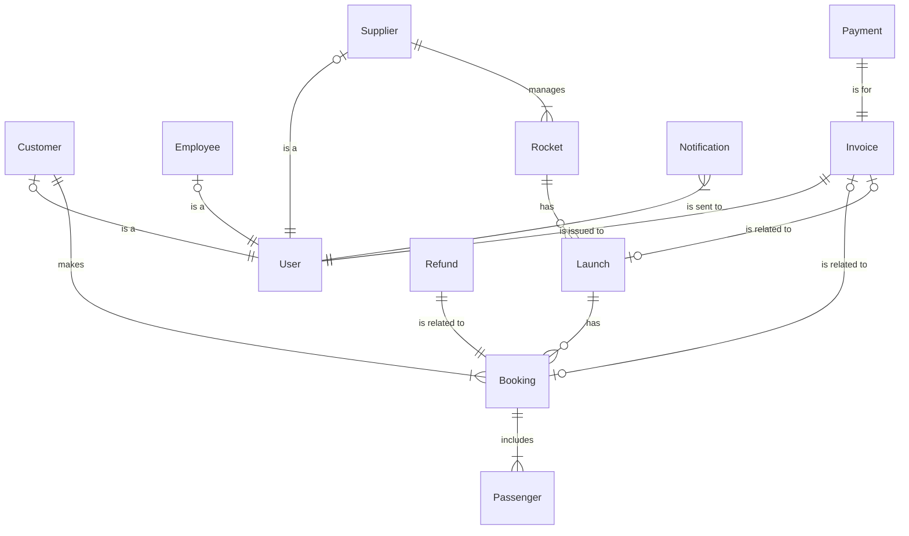

# Domain Model for Astro Bookings

## Entities

### User Management
- `User`: Base entity for all users of the system
- `Customer`: Represents a traveler who books trips
- `Supplier`: Represents a company offering space trips
- `Employee`: Represents an Astro Bookings staff member

### Travel Management
- `Rocket`: Represents a spacecraft used for launches
- `Launch`: Represents a scheduled space trip
- `Booking`: Represents a reservation made by a customer
- `Passenger`: Represents a person traveling on a launch

### Financial Management
- `Invoice`: Represents a billing document for services
- `Payment`: Represents a financial transaction
- `Refund`: Represents a return of funds to a customer

### Notification Management
- `Notification`: Represents a message sent to users

## Relationships

1. `Customer` _is a_ `User`: (0..1--1)
2. `Supplier` _is a_ `User`: (0..1--1)
3. `Employee` _is a_ `User`: (0..1--1)
4. `Supplier` _manages_ `Rocket`: (1..M)
5. `Rocket` _has_ `Launch`: (1..M)
6. `Customer` _makes_ `Booking`: (1..M)
7. `Launch` _has_ `Booking`: (1..M)
8. `Booking` _includes_ `Passenger`: (1..M)
9. `Invoice` _is issued to_ `User`: (1..1)
10. `Invoice` _is related to_ `Booking`: (0..1)
11. `Invoice` _is related to_ `Launch`: (0..1)
12. `Payment` _is for_ `Invoice`: (1..1)
13. `Refund` _is related to_ `Booking`: (1..1)
14. `Notification` _is sent to_ `User`: (1..M)

## Attribute details

### `User`
- **id**: Unique identifier `UUID`
- **email**: User's email address `Text`
- **password**: Hashed password `Text`
- **role**: User's role in the system [Customer, Supplier, Employee] `Enum`

### `Customer`
- **vipStatus**: Whether the customer is a VIP `Boolean`
- tripsBooked: Number of trips booked (0..M) `Integer`

### `Supplier`
- **companyName**: Name of the supplier company `Text`
- **feePercentage**: Current fee percentage for the supplier (0.8..1.0) `Decimal`

### `Employee`
- **department**: Employee's department `Text`

### `Rocket`
- **id**: Unique identifier `UUID`
- **name**: Name of the rocket `Text`
- **capacity**: Passenger capacity (1..M) `Integer`
- **range**: Maximum travel range `Text`

### `Launch`
- **id**: Unique identifier `UUID`
- **date**: Scheduled date of the launch `Date`
- **pricePerSeat**: Cost per seat (>0) `Decimal`
- **spaceport**: Name or location of the spaceport `Text`
- status: Current status of the launch [Scheduled, Delayed, Completed, Aborted] `Enum`

### `Booking`
- **id**: Unique identifier `UUID`
- **numberOfSeats**: Number of seats booked (1..6) `Integer`
- **totalPrice**: Total price of the booking (>0) `Decimal`
- status: Current status of the booking [Confirmed, Cancelled] `Enum`

### `Passenger`
- **id**: Unique identifier `UUID`
- **name**: Passenger's full name `Text`
- **age**: Passenger's age (18..70) `Integer`
- **contactInformation**: Passenger's contact details `Text`

### `Invoice`
- **id**: Unique identifier `UUID`
- **number**: Invoice number `Text`
- **date**: Date of issue `Date`
- **amount**: Total amount (>0) `Decimal`
- type: Type of invoice [Customer, Supplier, Refund] `Enum`
- status: Payment status [Pending, Paid, Cancelled] `Enum`

### `Payment`
- **id**: Unique identifier `UUID`
- **amount**: Payment amount (>0) `Decimal`
- **date**: Date of payment `Date`
- method: Payment method [CreditCard, BankTransfer, Other] `Enum`

### `Refund`
- **id**: Unique identifier `UUID`
- **amount**: Refund amount (>0) `Decimal`
- **date**: Date of refund `Date`
- reason: Reason for refund `Text`

### `Notification`
- **id**: Unique identifier `UUID`
- **message**: Content of the notification `Text`
- **date**: Date and time of the notification `DateTime`
- type: Type of notification [NewLaunch, BookingConfirmation, LaunchUpdate, Invoice] `Enum`
- status: Delivery status [Sent, Delivered, Failed] `Enum`

## Mermaid diagram code

