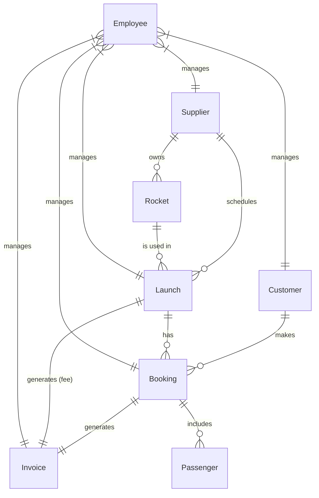

# Project: Astro Bookings Admin API Entity-Relationship Diagram

> Timestamp: 07/08/2024 14:45

## Entities

1. Supplier: A company that provides rocket launches
2. Rocket: A spacecraft capable of carrying passengers
3. Launch: A scheduled space trip using a specific rocket
4. Customer: A person who can book seats on rocket launches
5. Booking: A reservation of seats on a specific launch
6. Invoice: A financial document for a booking or launch
7. Employee: An Astro Bookings staff member
8. Passenger: A person traveling on a specific launch

## Relationships

1. Supplier _(1 to 0 or many)_ Rocket
   - `Supplier` _owns_ `Rocket`
   - `Rocket` _belongs to_ `Supplier`
2. Supplier _(1 to 0 or many)_ Launch
   - `Supplier` _schedules_ `Launch`
   - `Launch` _is scheduled by_ `Supplier`
3. Rocket _(1 to 0 or many)_ Launch
   - `Rocket` _is used in_ `Launch`
   - `Launch` _uses_ `Rocket`
4. Customer _(1 to 0 or many)_ Booking
   - `Customer` _makes_ `Booking`
   - `Booking` _is made by_ `Customer`
5. Launch _(1 to 0 or many)_ Booking
   - `Launch` _has_ `Booking`
   - `Booking` _is for_ `Launch`
6. Booking _(1 to 1)_ Invoice
   - `Booking` _generates_ `Invoice`
   - `Invoice` _is for_ `Booking`
7. Launch _(1 to 1)_ Invoice
   - `Launch` _generates_ `Invoice` (for supplier fee)
   - `Invoice` _is for_ `Launch`
8. Booking _(1 to 1 or many)_ Passenger
   - `Booking` _includes_ `Passenger`
   - `Passenger` _is part of_ `Booking`

## Mermaid Diagram Code

## Additional Notes

1. The Spaceport is represented as a textual attribute within the Launch entity, not as a separate entity.
2. The Passenger entity represents the individuals traveling on a launch, allowing bookings to have a list of passengers.
3. The Employee entity is shown managing other entities to represent their role in overseeing various aspects of the system.
4. The previously mentioned relationship between Supplier and Passenger has been removed as it was unnecessary.

This refined E-R diagram reflects the core entities and relationships for the Admin API, focusing on the operational needs of suppliers and employees while also considering the connection to customer bookings and passenger information.
