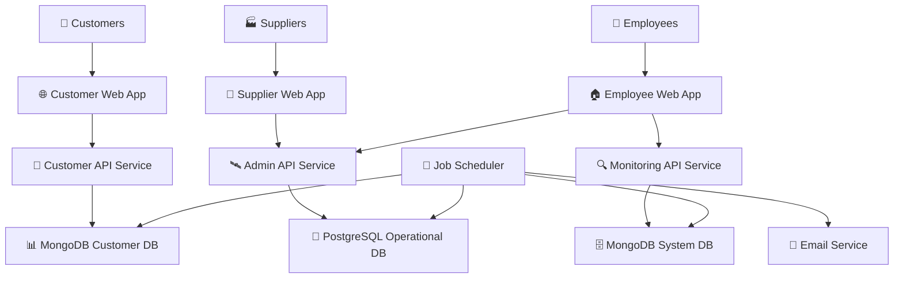

# Project: Astro Bookings System Architecture

> Timestamp: 07/08/2024 13:00

## Software Components

### 🌐 Customer Web Application

- 📋 UI for customers to view launches, book seats, and manage reservations
- 🧑‍💻 **Angular, TypeScript, HTML, CSS**
- ⬇️ Consumes `🚀 Customer API Service`
- ⬆️ Provides for `👤 Customers`

### 🏢 Supplier Web Application

- 📋 UI for suppliers to manage rockets, launches, and view bookings
- 🧑‍💻 **Angular, TypeScript, HTML, CSS**
- ⬇️ Consumes `🛰️ Admin API Service`
- ⬆️ Provides for `🏭 Suppliers`

### 🏠 Employee Web Application

- 📋 UI for employees to manage bookings, invoices, and view system status
- 🧑‍💻 **Angular, TypeScript, HTML, CSS**
- ⬇️ Consumes `🛰️ Admin API Service`, `🔍 Monitoring API Service`
- ⬆️ Provides for `👷 Employees`

### 🚀 Customer API Service

- Handles customer-facing operations and data processing
- 🧑‍💻 **Node.js, Nest.js, TypeScript**
- ⬇️ Consumes `📊 MongoDB Customer Database`
- ⬆️ Provides for `🌐 Customer Web Application`

### 🛰️ Admin API Service

- Manages supplier and employee operations
- 🧑‍💻 **Node.js, Nest.js, TypeScript**
- ⬇️ Consumes `📇 PostgreSQL Operational Database`
- ⬆️ Provides for `🏢 Supplier Web Application`, `🏠 Employee Web Application`

### 🔍 Monitoring API Service

- Handles system logs, user authentication, and monitoring
- 🧑‍💻 **Node.js, Nest.js, TypeScript**
- ⬇️ Consumes `🗄️ MongoDB System Database`
- ⬆️ Provides for `🏠 Employee Web Application`

### 📅 Job Scheduler

- Manages email notifications and database synchronization
- 🧑‍💻 **Node.js, TypeScript**
- ⬇️ Consumes `📇 PostgreSQL Operational Database`, `📊 MongoDB Customer Database`, `🗄️ MongoDB System Database`
- ⬆️ Provides for `📧 Email Service`

## Database Components

### 📇 PostgreSQL Operational Database

- Stores operational data for suppliers and employees
- 🧑‍💻 **PostgreSQL**
- ⬆️ Provides for `🛰️ Admin API Service`, `📅 Job Scheduler`

### 📊 MongoDB Customer Database

- Stores customer-facing data for quick access
- 🧑‍💻 **MongoDB**
- ⬆️ Provides for `🚀 Customer API Service`, `📅 Job Scheduler`

### 🗄️ MongoDB System Database

- Stores system logs, user credentials, and monitoring data
- 🧑‍💻 **MongoDB**
- ⬆️ Provides for `🔍 Monitoring API Service`, `📅 Job Scheduler`

## External Services

### 📧 Email Service

- Sends notifications to customers and suppliers
- ⬆️ Provides for `📅 Job Scheduler`

## System Architecture Diagram

## Key Architecture Decisions

1. **Separation of Concerns**: The system is divided into distinct components for customers, suppliers, and employees, each with its own web application and API service.

2. **Database Separation**:

   - PostgreSQL for operational data (suppliers and employees)
   - MongoDB for customer-facing data and system logs
     This separation allows for optimized performance and scalability for different types of data and access patterns.

3. **Microservices Architecture**: The use of separate API services for different functionalities allows for independent scaling and maintenance.

4. **Job Scheduler**: A centralized component for handling asynchronous tasks like email notifications and database synchronization.

5. **Monitoring**: A dedicated API service and database for system logs and user authentication, supporting the reliability and security requirements.

6. **Technology Stack**:

   - Frontend: Angular for all web applications
   - Backend: Node.js with Nest.js framework
   - Databases: PostgreSQL and MongoDB

7. **Scalability**: The architecture allows for horizontal scaling of individual components as needed.

8. **Security**: User authentication is centralized in the Monitoring API Service, separate from operational data.

This architecture aims to fulfill the requirements for scalability, security, and reliability as specified in the provided documents, while also supporting the business needs of Astro Bookings.
