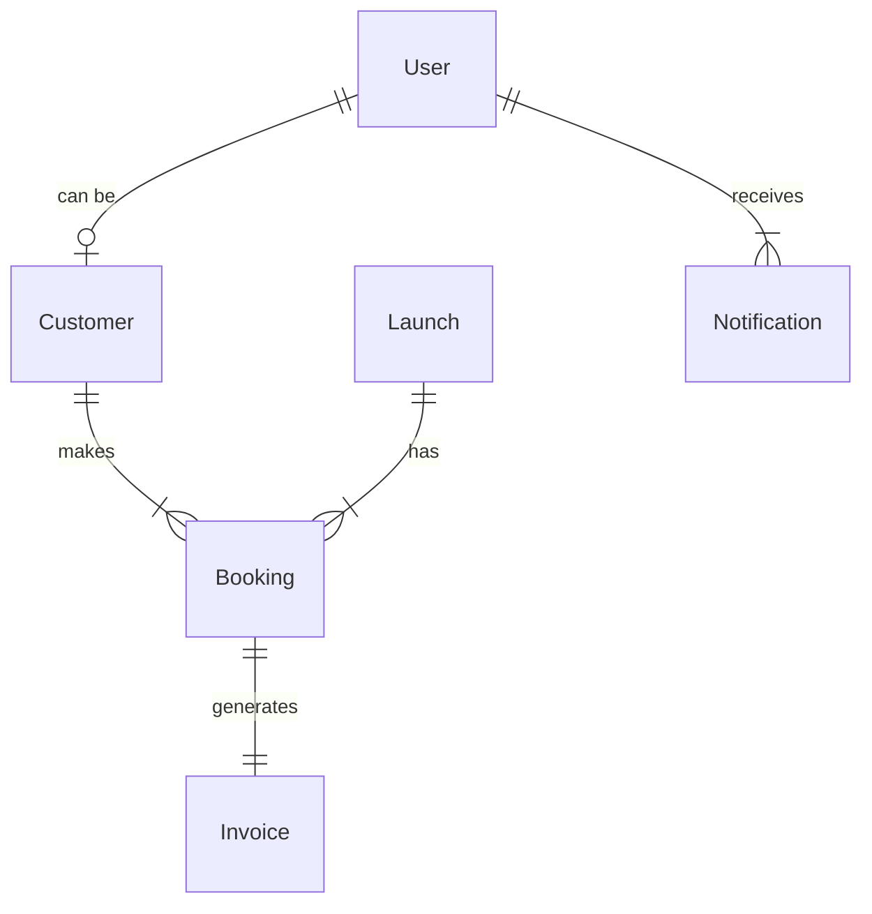
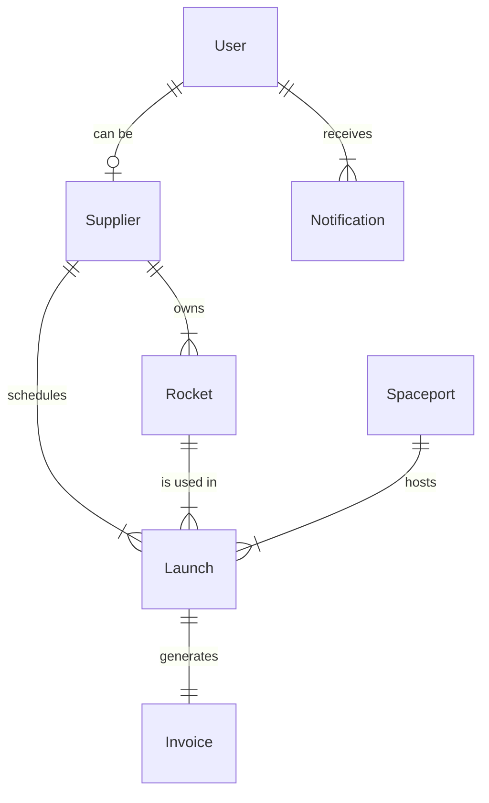
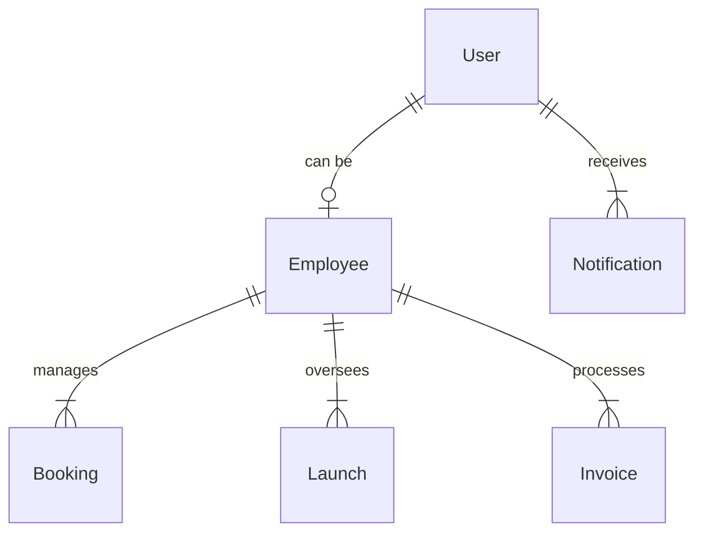
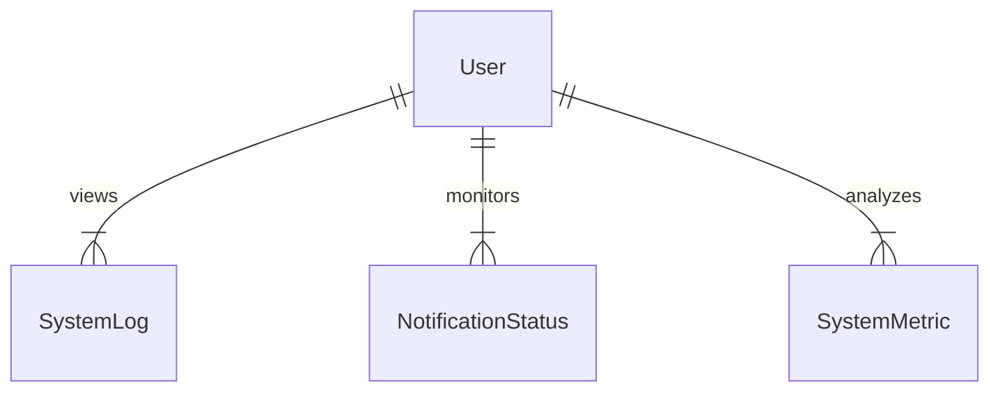
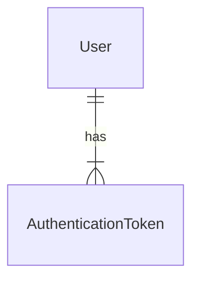
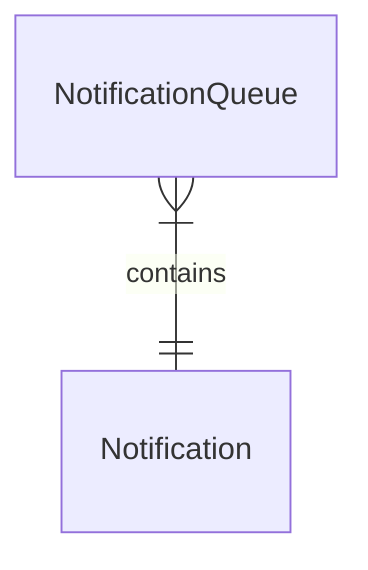

# AstroBookings: Entity-Relationship Model by Component

> Timestamp: 07/08/2024 13:30

## Customer Web Application & Customer API Service

### Entities

1. User
2. Customer
3. Launch
4. Booking
5. Invoice (Customer)
6. Notification

### Relationships

1. User (1) to Customer (0 or 1)
   - `User` _can be a_ `Customer`
   - `Customer` _is a_ `User`

2. Customer (1) to Booking (0 or many)
   - `Customer` _makes_ `Booking`
   - `Booking` _is made by_ `Customer`

3. Launch (1) to Booking (0 or many)
   - `Launch` _has_ `Booking`
   - `Booking` _is for_ `Launch`

4. Booking (1) to Invoice (1)
   - `Booking` _generates_ `Invoice`
   - `Invoice` _is for_ `Booking`

5. User (1) to Notification (0 or many)
   - `User` _receives_ `Notification`
   - `Notification` _is sent to_ `User`

## Supplier Web Application & Admin API Service

### Entities

1. User
2. Supplier
3. Rocket
4. Launch
5. Spaceport
6. Invoice (Supplier)
7. Notification

### Relationships

1. User (1) to Supplier (0 or 1)
   - `User` _can be a_ `Supplier`
   - `Supplier` _is a_ `User`

2. Supplier (1) to Rocket (1 or many)
   - `Supplier` _owns_ `Rocket`
   - `Rocket` _belongs to_ `Supplier`

3. Supplier (1) to Launch (0 or many)
   - `Supplier` _schedules_ `Launch`
   - `Launch` _is scheduled by_ `Supplier`

4. Rocket (1) to Launch (0 or many)
   - `Rocket` _is used in_ `Launch`
   - `Launch` _uses_ `Rocket`

5. Spaceport (1) to Launch (0 or many)
   - `Spaceport` _hosts_ `Launch`
   - `Launch` _takes off from_ `Spaceport`

6. Launch (1) to Invoice (1)
   - `Launch` _generates_ `Invoice`
   - `Invoice` _is for_ `Launch`

7. User (1) to Notification (0 or many)
   - `User` _receives_ `Notification`
   - `Notification` _is sent to_ `User`

## Employee Web Application & Admin API Service

### Entities

1. User
2. Employee
3. Booking
4. Launch
5. Invoice
6. Notification

### Relationships

1. User (1) to Employee (0 or 1)
   - `User` _can be an_ `Employee`
   - `Employee` _is a_ `User`

2. Employee (1) to Booking (0 or many)
   - `Employee` _manages_ `Booking`
   - `Booking` _is managed by_ `Employee`

3. Employee (1) to Launch (0 or many)
   - `Employee` _oversees_ `Launch`
   - `Launch` _is overseen by_ `Employee`

4. Employee (1) to Invoice (0 or many)
   - `Employee` _processes_ `Invoice`
   - `Invoice` _is processed by_ `Employee`

5. User (1) to Notification (0 or many)
   - `User` _receives_ `Notification`
   - `Notification` _is sent to_ `User`

## IT Operations Web Application & System Monitoring API Service

### Entities

1. User
2. SystemLog
3. NotificationStatus
4. SystemMetric

### Relationships

1. User (1) to SystemLog (0 or many)
   - `User` _views_ `SystemLog`
   - `SystemLog` _is viewed by_ `User`

2. User (1) to NotificationStatus (0 or many)
   - `User` _monitors_ `NotificationStatus`
   - `NotificationStatus` _is monitored by_ `User`

3. User (1) to SystemMetric (0 or many)
   - `User` _analyzes_ `SystemMetric`
   - `SystemMetric` _is analyzed by_ `User`

## Authentication Service

### Entities

1. User
2. AuthenticationToken

### Relationships

1. User (1) to AuthenticationToken (0 or many)
   - `User` _has_ `AuthenticationToken`
   - `AuthenticationToken` _belongs to_ `User`

## Data Synchronization Job

### Entities

1. SyncLog

### Relationships

This job doesn't introduce new relationships but works with existing entities across databases.

## Notification Job

### Entities

1. NotificationQueue

### Relationships

1. NotificationQueue (0 or many) to Notification (1)
   - `NotificationQueue` _contains_ `Notification`
   - `Notification` _is queued in_ `NotificationQueue`

