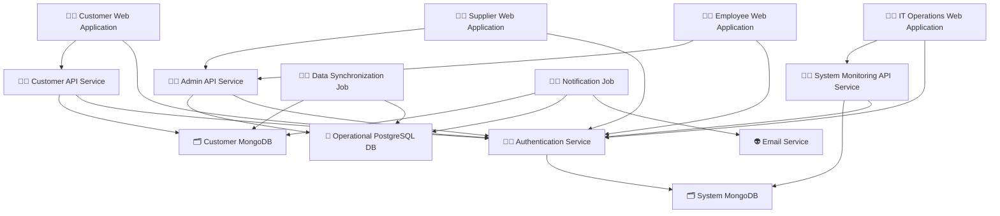

# AstroBookings: System Architecture

> Timestamp: 07/08/2024 12:00

## Software Components

### 🧑‍💻 Customer Web Application

- 📋 A web application for customers to view launches, book seats, and manage their reservations.
- 🧑‍💻 **Angular, TypeScript**
- ⬇️ Consumes `🧑‍💼 Customer API Service`
- ⬆️ Provides for `🙋‍♂️ Customers`

### 🧑‍💻 Supplier Web Application

- 📋 A web application for suppliers to manage their rockets, launches, and view bookings.
- 🧑‍💻 **Angular, TypeScript**
- ⬇️ Consumes `🧑‍💼 Admin API Service`
- ⬆️ Provides for `🙋‍♂️ Suppliers`

### 🧑‍💻 Employee Web Application

- 📋 A web application for employees to manage bookings, launches, and financial operations.
- 🧑‍💻 **Angular, TypeScript**
- ⬇️ Consumes `🧑‍💼 Admin API Service`
- ⬆️ Provides for `🙋‍♂️ Employees`

### 🧑‍💻 IT Operations Web Application

- 📋 A web application for IT operators to monitor system logs and notification statuses.
- 🧑‍💻 **Angular, TypeScript**
- ⬇️ Consumes `🧑‍💼 System Monitoring API Service`
- ⬆️ Provides for `🙋‍♂️ IT Operators`

### 🧑‍💼 Customer API Service

- 📋 API service handling customer-related operations and data access.
- 🧑‍💻 **NestJS, TypeScript**
- ⬇️ Consumes `🗂️ Customer MongoDB`
- ⬆️ Provides for `🧑‍💻 Customer Web Application`

### 🧑‍💼 Admin API Service

- 📋 API service handling supplier and employee operations, and core business logic.
- 🧑‍💻 **NestJS, TypeScript**
- ⬇️ Consumes `📇 Operational PostgreSQL DB`
- ⬆️ Provides for `🧑‍💻 Supplier Web Application`, `🧑‍💻 Employee Web Application`

### 🧑‍💼 System Monitoring API Service

- 📋 API service for accessing system logs and monitoring data.
- 🧑‍💻 **NestJS, TypeScript**
- ⬇️ Consumes `🗂️ System MongoDB`
- ⬆️ Provides for `🧑‍💻 IT Operations Web Application`

### 🧑‍💼 Authentication Service

- 📋 Centralized authentication service for all user types.
- 🧑‍💻 **NestJS, TypeScript**
- ⬇️ Consumes `🗂️ System MongoDB`
- ⬆️ Provides for all web applications and API services

### 🧑‍🏭 Data Synchronization Job

- 📋 Background job for synchronizing data between PostgreSQL and MongoDB databases.
- 🧑‍💻 **Node.js, TypeScript**
- ⬇️ Consumes `📇 Operational PostgreSQL DB`, `🗂️ Customer MongoDB`

### 🧑‍🏭 Notification Job

- 📋 Background job for sending email notifications to customers and suppliers.
- 🧑‍💻 **Node.js, TypeScript**
- ⬇️ Consumes `📇 Operational PostgreSQL DB`, `🗂️ Customer MongoDB`
- ⬇️ Consumes `👽 Email Service`

## Database Components

### 📇 Operational PostgreSQL DB

- 📋 Relational database for storing core operational data.
- 🧑‍💻 **PostgreSQL**
- ⬆️ Provides for `🧑‍💼 Admin API Service`, `🧑‍🏭 Data Synchronization Job`, `🧑‍🏭 Notification Job`

### 🗂️ Customer MongoDB

- 📋 NoSQL database for storing customer-related data and quick access.
- 🧑‍💻 **MongoDB**
- ⬆️ Provides for `🧑‍💼 Customer API Service`, `🧑‍🏭 Data Synchronization Job`, `🧑‍🏭 Notification Job`

### 🗂️ System MongoDB

- 📋 NoSQL database for storing system logs, user credentials, and monitoring data.
- 🧑‍💻 **MongoDB**
- ⬆️ Provides for `🧑‍💼 System Monitoring API Service`, `🧑‍💼 Authentication Service`

## External Services

### 👽 Email Service

- 📋 External service for sending email notifications.
- ⬆️ Provides for `🧑‍🏭 Notification Job`

## System Architecture diagram

