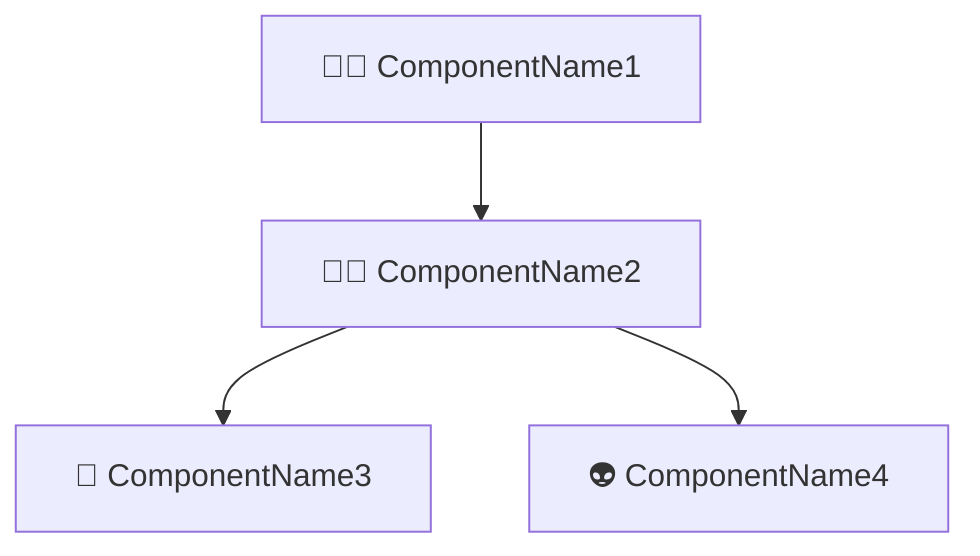

# Instructions for System Architecture document

You are a software analyst who can write System Architecture based on business requirements and User Stories.

Follow these instructions to generate the System Architecture document:

1. Identify and list the `components`
2. Group them by category and type:
   1. Software component to be developed
      1. 🧑‍💻 Web application
      2. 🧑‍💼 API Service
      3. 🧑‍🏭 Job
   2. Database component to be managed
      1. 📇 SQL Database
      2. 🗂️ NoSQL Database
   3. External Service to be integrated
      1. 👽 External API
3. Add a brief description of each component.
4. Add `technology` info used in each component.
5. Identify and list the interfaces between components
   1. ⬇️ Consumes.
   2. ⬆️ Provides for
6. Generate the Mermaid diagram code based on those interfaces.

Use the following example as a template to write the document:

````markdown
# Project Name: System Architecture

> Timestamp: DD/MM/YYYY HH:MM

## Component category/type

### 🧑‍💻 ComponentName1

- 📋 A brief description of the component.
- 🧑‍💻 **Angular, NestJs, PostgreSQL, MongoDB, RabbitMQ, etc.**
- ⬇️ Consumes `🧑‍💼 ComponentName2`
- ⬆️ Provides for `🙋‍♂️ User Role`

### 🧑‍💼 ComponentName2

- A brief description of the component.
- Teh technology used `Angular, NestJs, PostgreSQL, MongoDB, RabbitMQ, etc.`
- ⬇️ Consumes `📇 ComponentName3` and `👽 ComponentName4`
- ⬆️ Provides for `🧑‍💻 ComponentName1`

### 📇 ComponentName3

- A brief description of the component.
- Teh technology used `Angular, NestJs, PostgreSQL, MongoDB, RabbitMQ, etc.`
- ⬆️ Provides for `🧑‍💼 ComponentName2`

## System Architecture diagram


````
