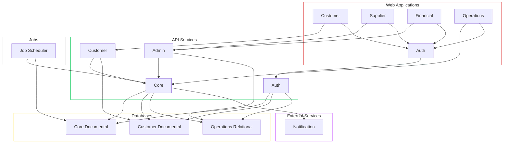

# AstroBookings: System Architecture

> Generated on: Monday, August 12, 2024, 11:30 AM UTC

## Software Components

### 🧑‍💻 Auth Web Application

- 📋 User interface for registering and validating user credentials
- 🧑‍💻 `Angular`
- ⬇️ Auth API Service
- ⬆️ Visitors, Customers, Suppliers, Financial Employees, IT Employees

### 🧑‍💻 Customer Web Application

- 📋 User interface for customers to view launches and make bookings
- 🧑‍💻 `Angular`
- ⬇️ Customer API Service, Auth Web Application
- ⬆️ Visitors, Customers

### 🧑‍💻 Supplier Web Application

- 📋 User interface for suppliers to manage rockets, launches, and view bookings
- 🧑‍💻 `Angular`
- ⬇️ Admin API Service, Auth Web Application
- ⬆️ Suppliers

### 🧑‍💻 Financial Web Application

- 📋 User interface for financial employees to manage invoices and payments
- 🧑‍💻 `Angular`
- ⬇️ Admin API Service, Auth Web Application
- ⬆️ Financial Employees

### 🧑‍💻 Operations Web Application

- 📋 User interface for IT operators to manage jobs and check logs
- 🧑‍💻 `Angular`
- ⬇️ Core API Service, Auth Web Application
- ⬆️ IT Employees

### 🧑‍💻 Auth API Service

- 📋 Handles authorization logic and persistence
- 🧑‍💻 `Nest.js`
- ⬇️ Core Documental Database, Customer Documental Database, Operations Relational Database
- ⬆️ Auth Web Application, Customer API Service, Admin API Service

### 🧑‍💻 Customer API Service

- 📋 Handles customer-facing operations (bookings, launch info)
- 🧑‍💻 `Nest.js`
- ⬇️ Core API Service, Customer Documental Database
- ⬆️ Customer Web Application

### 🧑‍💻 Admin API Service

- 📋 Handles supplier and employee operations
- 🧑‍💻 `Nest.js`
- ⬇️ Core API Service, Operations Relational Database
- ⬆️ Supplier Web Application, Financial Web Application

### 🧑‍💻 Core API Service

- 📋 Handles Jobs and logs
- 🧑‍💻 `Nest.js`
- ⬇️ Core Documental Database, Customer Documental Database, Operations Relational Database, Notification Service
- ⬆️ Customer API Service, Admin API Service, Job Scheduler

### 🧑‍💻 Job Scheduler

- 📋 Handles jobs for email notifications and database synchronization
- 🧑‍💻 `Nest.js`
- ⬇️ Core API Service,Core Documental Database

## Database Components

### 📋 Operations Relational Database

- 📋 Stores relational data (suppliers, employees, detailed booking info)
- 🧑‍💻 `Postgres`
- ⬆️ Admin API Service, Core API Service

### 📋 Customer Documental Database

- 📋 Stores customer-facing data (launches, available seats)
- 🧑‍💻 `MongoDB`
- ⬆️ Customer API Service, Core API Service

### 📋 Core Documental Database

- 📋 Stores user credentials, system logs, and job queues
- 🧑‍💻 `MongoDB`
- ⬆️ Core API Service

## External Services

### 📋 Notification Service

- 📋 Sends emails to customers and suppliers
- ⬆️ Core API Service

## Summary graph

