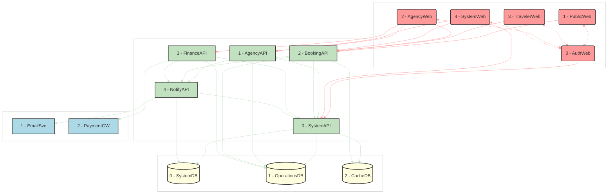

# AstroBookings: System Architecture

> Timestamp: 2024-08-19 16:30:00 UTC

## System Components

### 🌐 Web Applications

1. `🌐 PublicWeb`: Showcase of available launches and public information
2. `🌐 AgencyWeb`: Management interface for space agencies
3. `🌐 TravelerWeb`: Booking and management interface for travelers
4. `🌐 AdminWeb`: Administrative interface for AstroBookings employees

### 🧑‍💼 API Services

1. `🧑‍💼 AuthAPI`: Handles authentication and authorization
2. `🧑‍💼 AgencyAPI`: Manages agency profiles and launches
3. `🧑‍💼 BookingAPI`: Handles seat reservations and cancellations
4. `🧑‍💼 FinanceAPI`: Manages invoicing and payments
5. `🧑‍💼 NotifyAPI`: Handles email notifications
6. `🧑‍💼 SyncAPI`: Manages data synchronization between databases

### 📇 Databases

1. `📇 OperationsDB`: Stores structured data for bookings, launches, and financial transactions
2. `📇 SystemDB`: Stores user profiles, authentication data, system logs, notification queue, and sync operations queue
3. `📇 CacheDB`: Provides quick data access for public website and traveler portal

### 👽 External Services

1. `👽 EmailSvc`: For sending notifications
2. `👽 PaymentGW`: For processing payments

---

## Detailed Component Descriptions

### 🌐 PublicWeb

Public-facing website showcasing available space launches and company information made with **Angular**.

#### ⬇️ Consumes:

- `🧑‍💼 AuthAPI`: For user registration
- `🧑‍💼 BookingAPI`: To display available launches

#### ⬆️ Provides for:

- `👤 Visitor`: Browse launches, view company information
- `🧑 Traveler`: Register for an account

### 🌐 AgencyWeb

- 📋 Management interface for space agencies to manage their profiles, rockets, and launches
- **Angular**

⬇️ Consumes:

- `🧑‍💼 AuthAPI`: For agency authentication
- `🧑‍💼 AgencyAPI`: To manage agency profile and launches
- `🧑‍💼 BookingAPI`: To view bookings for their launches
- `🧑‍💼 FinanceAPI`: To access financial reports and invoices

⬆️ Provides for:

- `👨‍💼 Agency Staff`: Manage agency profile, rockets, launches, and view financial information

### 🌐 TravelerWeb

- 📋 Interface for travelers to book launches, manage reservations, and view trip details
- **Angular**

⬇️ Consumes:

- `🧑‍💼 AuthAPI`: For traveler authentication
- `🧑‍💼 BookingAPI`: To make and manage bookings
- `🧑‍💼 NotifyAPI`: To manage notification preferences

⬆️ Provides for:

- `🧑 Traveler`: Book launches, manage reservations, view trip details

### 🌐 AdminWeb

- 📋 Administrative interface for AstroBookings employees to manage the platform
- **Angular**

⬇️ Consumes:

- `🧑‍💼 AuthAPI`: For admin authentication
- `🧑‍💼 AgencyAPI`: To manage agencies
- `🧑‍💼 BookingAPI`: To oversee all bookings
- `🧑‍💼 FinanceAPI`: To manage financial operations
- `🧑‍💼 NotifyAPI`: To manage system notifications
- `🧑‍💼 SyncAPI`: To monitor and manage data synchronization

⬆️ Provides for:

- `👨‍💼 Admin`: Manage all aspects of the AstroBookings platform

