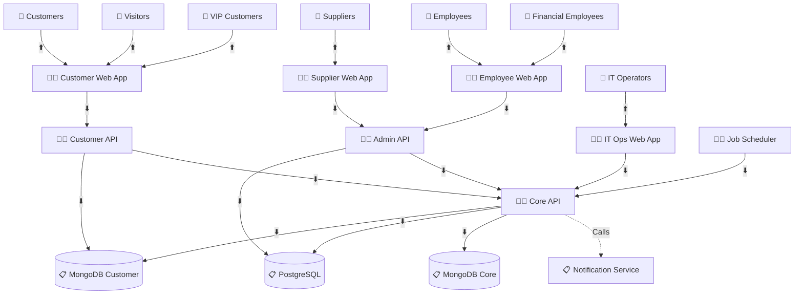

# AstroBookings: System Architecture

> Generated on: Monday, August 12, 2024, 11:30 AM UTC

## Software Components

### 🧑‍💻 Customer Web Application

- 📋 User interface for customers to view launches and make bookings
- 🧑‍💻 **Angular, TypeScript, HTML, CSS**
- ⬇️ Consumes: Customer API Service
- ⬆️ Provides for: Customers, Visitors, VIP Customers

### 🧑‍💻 Supplier Web Application

- 📋 User interface for suppliers to manage rockets, launches, and view bookings
- 🧑‍💻 **Angular, TypeScript, HTML, CSS**
- ⬇️ Consumes: Admin API Service
- ⬆️ Provides for: Suppliers

### 🧑‍💻 Employee Web Application

- 📋 User interface for employees to manage financials and generate reports
- 🧑‍💻 **Angular, TypeScript, HTML, CSS**
- ⬇️ Consumes: Admin API Service
- ⬆️ Provides for: Employees, Financial Employees

### 🧑‍💻 IT Operations Web Application

- 📋 User interface for IT operators to check system logs and notification statuses
- 🧑‍💻 **Angular, TypeScript, HTML, CSS**
- ⬇️ Consumes: Core API Service
- ⬆️ Provides for: IT Operators

### 🧑‍💻 Customer API Service

- 📋 Handles customer-facing operations (bookings, launch info)
- 🧑‍💻 **Node.js, Nest.js, TypeScript**
- ⬇️ Consumes: Core API Service, MongoDB (Customer)
- ⬆️ Provides for: Customer Web Application

### 🧑‍💻 Admin API Service

- 📋 Handles supplier and employee operations
- 🧑‍💻 **Node.js, Nest.js, TypeScript**
- ⬇️ Consumes: Core API Service, PostgreSQL
- ⬆️ Provides for: Supplier Web Application, Employee Web Application

### 🧑‍💻 Core API Service

- 📋 Handles authentication, logging, and core system operations
- 🧑‍💻 **Node.js, Nest.js, TypeScript**
- ⬇️ Consumes: PostgreSQL, MongoDB (Customer), MongoDB (Core)
- ⬆️ Provides for: All other services
- ⬆️ Calls: External Notification Service

### 🧑‍💻 Job Scheduler

- 📋 Handles email notifications and database synchronization
- 🧑‍💻 **Node.js, TypeScript**
- ⬇️ Consumes: Core API Service

## Database Components

### 📋 PostgreSQL Database

- 📋 Stores relational data (suppliers, employees, detailed booking info)
- ⬆️ Provides for: Admin API Service, Core API Service

### 📋 MongoDB Database (Customer)

- 📋 Stores customer-facing data (launches, available seats)
- ⬆️ Provides for: Customer API Service, Core API Service

### 📋 MongoDB Database (Core)

- 📋 Stores user credentials, system logs, and job queues
- ⬆️ Provides for: Core API Service

## External Services

### 📋 Notification Service

- 📋 Sends emails to customers and suppliers
- ⬆️ Called by: Core API Service

## System Architecture Diagram

