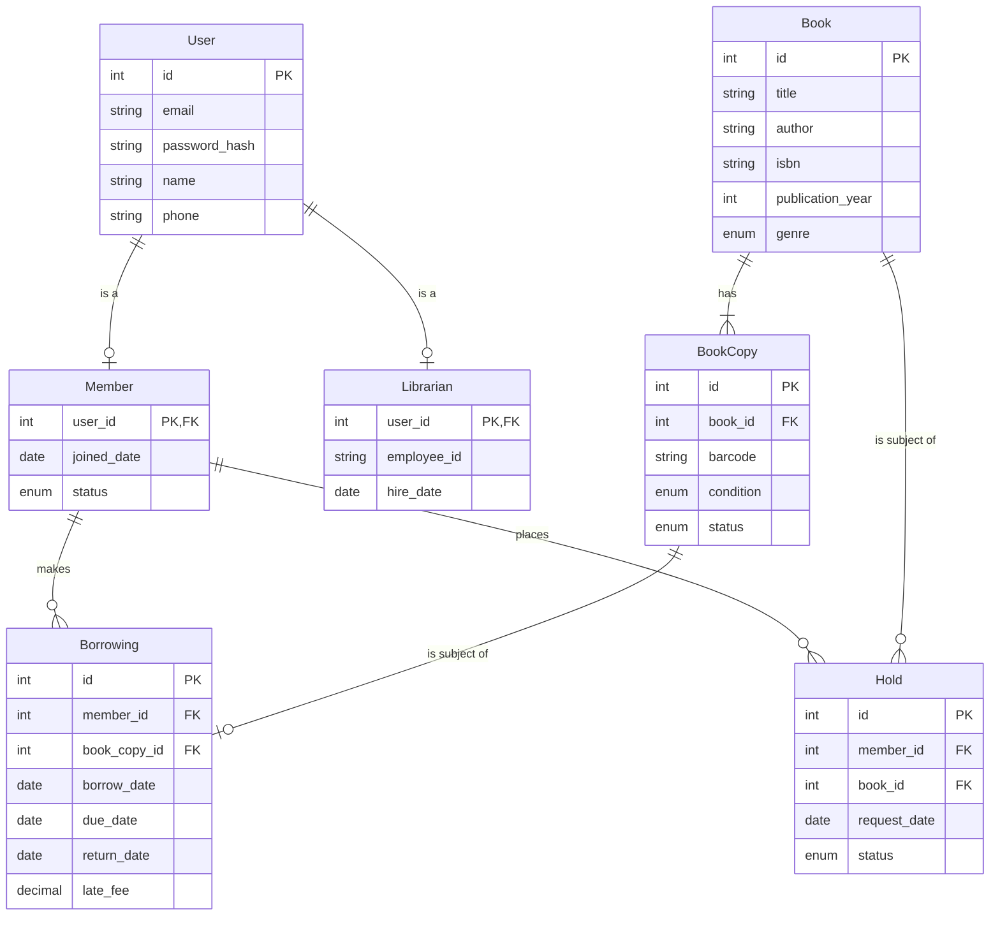

# LibrarySystem: Entity-Relationship Diagram

> Timestamp: 2024-08-20 11:30:00 UTC

## Entities

1. `User`: Base entity for all system users. Contains common information such as login credentials and contact details.

2. `Member`: Specialization of User. Represents registered library members who can borrow books.

3. `Librarian`: Specialization of User. Represents library staff with administrative privileges.

4. `Book`: Represents a book in the library catalog.

5. `BookCopy`: Represents a physical copy of a book that can be borrowed.

6. `Borrowing`: Represents the act of a member borrowing a book copy.

7. `Hold`: Represents a member's request to borrow a book that is currently unavailable.

## Relationships

1. User _(1 to 0 or 1)_ Member
   - `User` _can be a_ `Member`
   - `Member` _is a_ `User`

2. User _(1 to 0 or 1)_ Librarian
   - `User` _can be a_ `Librarian`
   - `Librarian` _is a_ `User`

3. Book _(1 to 1 or many)_ BookCopy
   - `Book` _has_ `BookCopy`
   - `BookCopy` _is an instance of_ `Book`

4. Member _(1 to 0 or many)_ Borrowing
   - `Member` _makes_ `Borrowing`
   - `Borrowing` _is made by_ `Member`

5. BookCopy _(1 to 0 or 1)_ Borrowing
   - `BookCopy` _is subject of_ `Borrowing`
   - `Borrowing` _involves_ `BookCopy`

6. Member _(1 to 0 or many)_ Hold
   - `Member` _places_ `Hold`
   - `Hold` _is placed by_ `Member`

7. Book _(1 to 0 or many)_ Hold
   - `Book` _is subject of_ `Hold`
   - `Hold` _is for_ `Book`

## Entity-Relationship Diagram

