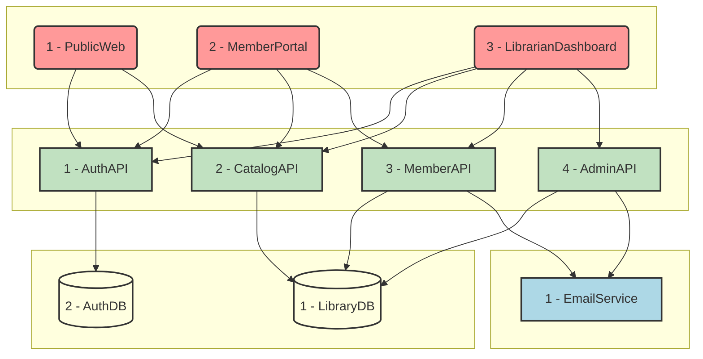

# LibrarySystem: System Architecture

> Timestamp: 2024-08-20 11:00:00 UTC

## System Components

### 🌐 Web Applications

1. `🌐 PublicWeb`: Public-facing website for catalog browsing and member registration
2. `🌐 MemberPortal`: Member interface for account management and book borrowing
3. `🌐 LibrarianDashboard`: Administrative interface for librarians

### 🧑‍💼 API Services

1. `🧑‍💼 AuthAPI`: Handles authentication and authorization
2. `🧑‍💼 CatalogAPI`: Manages book catalog operations
3. `🧑‍💼 MemberAPI`: Handles member profile and borrowing operations
4. `🧑‍💼 AdminAPI`: Provides administrative functions for librarians

### 📇 Databases

1. `📇 LibraryDB`: Main database storing books, members, and borrowing records
2. `📇 AuthDB`: Stores user authentication and authorization data

### 👽 External Services

1. `👽 EmailService`: For sending notifications and alerts

## System Architecture Diagram

## Detailed Component Descriptions

### 1. 🌐 PublicWeb

Public-facing website that allows visitors to browse the library catalog and register as members. It provides an intuitive interface for searching books and accessing basic library information.

Built with **React** and **TypeScript** for a responsive and dynamic user experience.

#### ⬇️ Consumes:
- `🧑‍💼 AuthAPI`: For user registration
- `🧑‍💼 CatalogAPI`: To display book catalog and search results

#### ⬆️ Provides for:
- `👤 Visitor`: Browse catalog, view book details, register as a member
- `🧑 Member`: Log in to access member portal

### 2. 🌐 MemberPortal

Web application for registered library members to manage their accounts, view borrowed books, and place hold requests on books.

Developed using **React** and **TypeScript** with **Redux** for state management.

#### ⬇️ Consumes:
- `🧑‍💼 AuthAPI`: For member authentication
- `🧑‍💼 CatalogAPI`: To view book details and availability
- `🧑‍💼 MemberAPI`: To manage borrowings and account information

#### ⬆️ Provides for:
- `🧑 Member`: Manage account, view borrowed books, place holds, update profile

### 3. 🌐 LibrarianDashboard

Administrative interface for librarians to manage the library system, including book catalog, member accounts, and borrowing operations.

Built with **Angular** and **TypeScript** for a robust and feature-rich admin experience.

#### ⬇️ Consumes:
- `🧑‍💼 AuthAPI`: For librarian authentication
- `🧑‍💼 CatalogAPI`: To manage book catalog
- `🧑‍💼 MemberAPI`: To manage member accounts and borrowings
- `🧑‍💼 AdminAPI`: For administrative operations and reporting

#### ⬆️ Provides for:
- `👨‍💼 Librarian`: Manage catalog, handle member accounts, process borrowings and returns

### 1. 🧑‍💼 AuthAPI

Handles user authentication and authorization for all parts of the LibrarySystem. Manages user sessions and access control.

Developed using **Node.js** with **Express** and **Passport.js** for robust authentication handling.

#### ⬇️ Consumes:
- `📇 AuthDB`: To store and retrieve user authentication data

#### ⬆️ Provides for:
- All Web Applications: Authentication and authorization services
- Other APIs: User validation and role checking

### 2. 🧑‍💼 CatalogAPI

Manages all operations related to the book catalog, including searching, adding, updating, and removing books.

Built with **Node.js**, **Express**, and **TypeScript** for type-safe catalog management.

#### ⬇️ Consumes:
- `📇 LibraryDB`: To store and retrieve book catalog data

#### ⬆️ Provides for:
- `🌐 PublicWeb`: Book search and details
- `🌐 MemberPortal`: Book availability and details
- `🌐 LibrarianDashboard`: Full catalog management capabilities

### 3. 🧑‍💼 MemberAPI

Handles member-related operations including profile management, borrowing books, and managing holds.

Implemented using **Node.js**, **Express**, and **TypeScript** with **Sequelize** ORM for database interactions.

#### ⬇️ Consumes:
- `📇 LibraryDB`: To manage member profiles and borrowing records
- `👽 EmailService`: To send notifications about due dates and available holds

#### ⬆️ Provides for:
- `🌐 MemberPortal`: Member profile and borrowing management
- `🌐 LibrarianDashboard`: Member account management and borrowing operations

### 4. 🧑‍💼 AdminAPI

Provides administrative functions for librarians, including system configuration, reporting, and advanced catalog management.

Developed using **Node.js**, **Express**, and **TypeScript** with **Redis** for caching frequently accessed data.

#### ⬇️ Consumes:
- `📇 LibraryDB`: For comprehensive library data access and management
- `👽 EmailService`: To send system notifications and alerts

#### ⬆️ Provides for:
- `🌐 LibrarianDashboard`: Advanced administrative functions and reporting

### 1. 📇 LibraryDB

Main relational database storing book catalog, member information, and borrowing records.

Implemented using **PostgreSQL** for robust data management and complex querying capabilities.

#### ⬇️ Consumes data from:
- `🧑‍💼 CatalogAPI`: Book catalog updates
- `🧑‍💼 MemberAPI`: Member profile and borrowing updates
- `🧑‍💼 AdminAPI`: System-wide data management

#### ⬆️ Provides data for:
- `🧑‍💼 CatalogAPI`: Book information and availability
- `🧑‍💼 MemberAPI`: Member profiles and borrowing records
- `🧑‍💼 AdminAPI`: Comprehensive library data for administration and reporting

### 2. 📇 AuthDB

Dedicated database for storing user authentication and authorization data.

Uses **MongoDB** for flexible schema design and quick access to user credentials and roles.

#### ⬇️ Consumes data from:
- `🧑‍💼 AuthAPI`: User registration and role updates

#### ⬆️ Provides data for:
- `🧑‍💼 AuthAPI`: User authentication and role verification

### 1. 👽 EmailService

External service for sending email notifications to library members and staff.

Utilizes **SendGrid** API for reliable email delivery.

#### ⬇️ Consumes:
- Requests from `🧑‍💼 MemberAPI` and `🧑‍💼 AdminAPI` for sending notifications

#### ⬆️ Provides:
- Email delivery services for member notifications and system alerts

