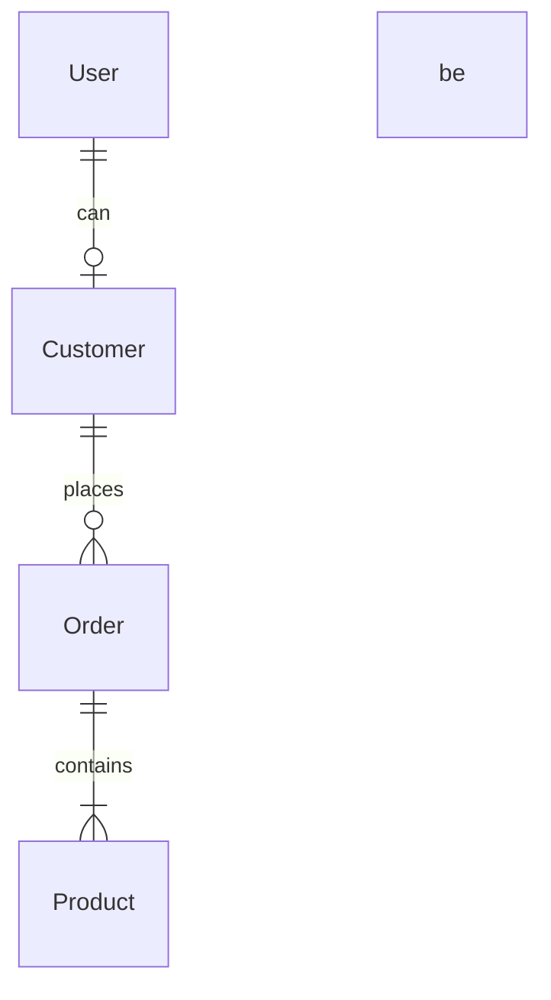

# Project: Entity-Relationship Diagram

> Timestamp: 2024-08-19 16:30:00 UTC

## Entities

1. `Customer`: A customer who can place orders.
2. `Order`: An order placed by a customer.
3. `Product`: A product that can be ordered.
4. `User`: A user who can log in to the system.

## Relationships

1. Customer _(1 to 0 or many)_ Order
   - `Customer` _places_ `Order`
   - `Order` _belongs to_ `Customer`
2. Order _(1 to 1 or many)_ Product
   - `Order` _contains_ `Product`
   - `Product` _is part of_ `Order`
3. User _(1 to 0 or 1)_ Customer
   - `User` _can be a_ `Customer`
   - `Customer` _is a_ `User`

## Mermaid Diagram Code

