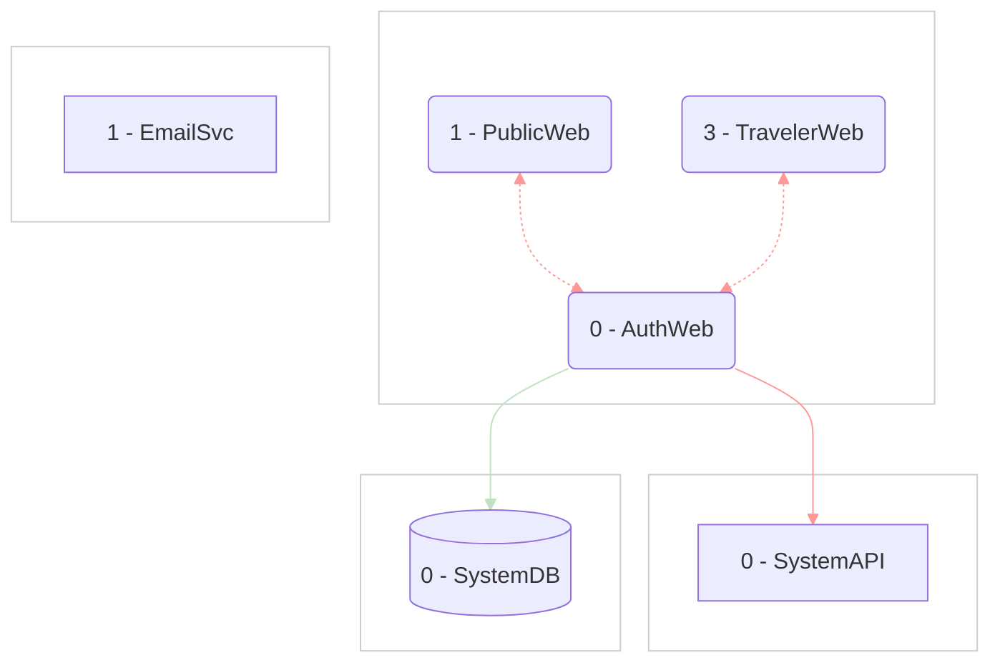

# Project: System Architecture

> Timestamp: 2024-08-19 16:30:00 UTC

## System Components

### 🌐 Web Applications

1. `🌐 PublicWeb`: Showcase of available launches and public information
2. `🌐 AgencyWeb`: Management interface for space agencies

### 🧑‍💼 API Services

### 📇 Databases

### 👽 External Services

---

## Detailed Component Descriptions

### 0. 🌐 AuthWeb

Centralized authentication and user management interface for all user types in the AstroBookings platform. It provides secure login, registration, and profile management functionalities for visitors, travelers, agencies, and employees. This component ensures a unified and secure entry point for all users accessing various parts of the system.

Built with **Angular** for a secure and user-friendly authentication experience.

#### ⬇️ Consumes:

- `🧑‍💼 SystemAPI`: For user authentication, registration, and profile management

#### ⬆️ Provides for:

- `🌐 PublicWeb`: Register new accounts, return with token
- `🌐 TravelerWeb`: Log in, return with token

## System Architecture Diagram

