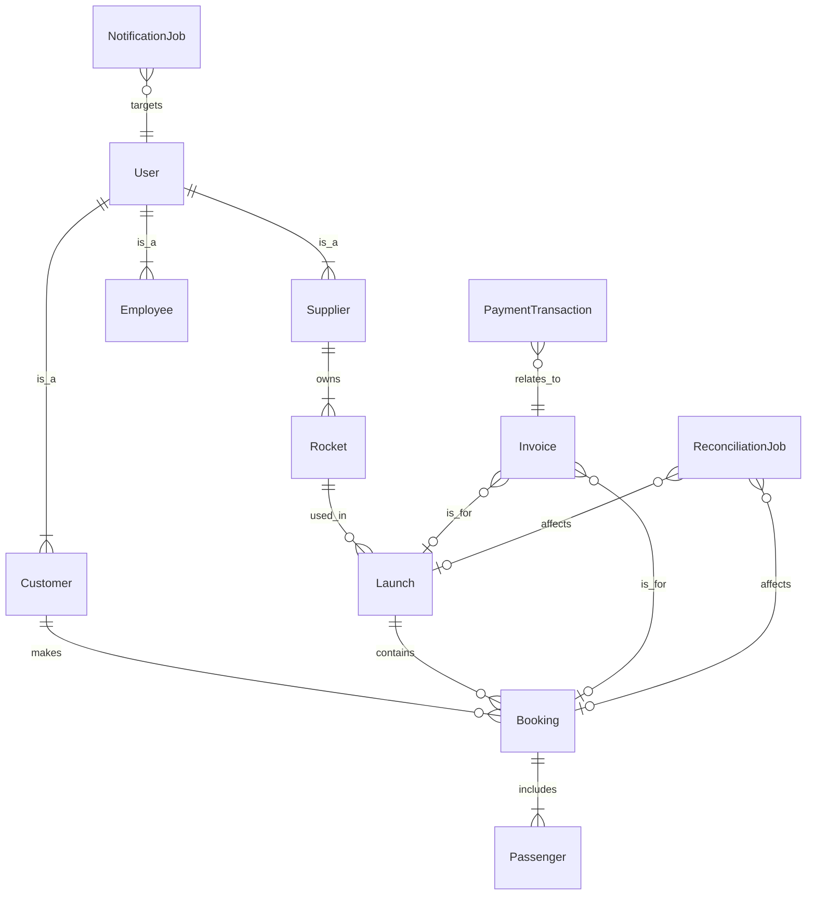

# AstroBookings: Entity-Relationship Model

## Entities

1. `User`: Represents all users of the system (customers, suppliers, employees, etc.)
2. `Customer`: A user who can book space trips
3. `Supplier`: A user who provides rockets and launches
4. `Employee`: A user who manages financial operations
5. `Rocket`: A spacecraft that can be used for launches
6. `Launch`: A scheduled space trip
7. `Booking`: A reservation made by a customer for a launch
8. `Passenger`: A person traveling on a booked launch
9. `Invoice`: A billing document for a booking or a launch
10. `PaymentTransaction`: A record of financial transactions
11. `ReconciliationJob`: A task to synchronize data between databases
12. `NotificationJob`: A task to send emails to users

## Relationships

1. Customer _(1 to 0 or many)_ Booking
   - `Customer` _makes_ `Booking`
   - `Booking` _is made by_ `Customer`

2. Supplier _(1 to 1 or many)_ Rocket
   - `Supplier` _owns_ `Rocket`
   - `Rocket` _is owned by_ `Supplier`

3. Rocket _(1 to 0 or many)_ Launch
   - `Rocket` _is used in_ `Launch`
   - `Launch` _uses_ `Rocket`

4. Launch _(1 to 0 or many)_ Booking
   - `Launch` _contains_ `Booking`
   - `Booking` _is for_ `Launch`

5. Booking _(1 to 1 or many)_ Passenger
   - `Booking` _includes_ `Passenger`
   - `Passenger` _is included in_ `Booking`

6. Invoice _(0 or many to 0 or 1)_ Booking
   - `Invoice` _is for_ `Booking`
   - `Booking` _may have_ `Invoice`

7. Invoice _(0 or many to 0 or 1)_ Launch
   - `Invoice` _is for_ `Launch`
   - `Launch` _may have_ `Invoice`

8. PaymentTransaction _(0 or many to 1)_ Invoice
   - `PaymentTransaction` _relates to_ `Invoice`
   - `Invoice` _has_ `PaymentTransaction`

9. ReconciliationJob _(0 or many to 0 or 1)_ Launch
   - `ReconciliationJob` _affects_ `Launch`
   - `Launch` _may be affected by_ `ReconciliationJob`

10. ReconciliationJob _(0 or many to 0 or 1)_ Booking
    - `ReconciliationJob` _affects_ `Booking`
    - `Booking` _may be affected by_ `ReconciliationJob`

11. NotificationJob _(0 or many to 1)_ User
    - `NotificationJob` _targets_ `User`
    - `User` _is targeted by_ `NotificationJob`

## Mermaid Diagram Code

