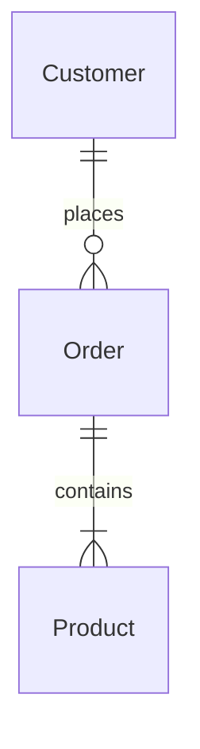

### 1. Entity-Relationship (E-R) Diagram

Generate the E-R diagram based on the system architecture and user stories for each software component.

Instructions:

1. Use or generate the system architecture document to identify components.
2. Ask the user for a software component to generate its domain model.
3. Generate one file for each software component.
   1. Use the component name as the title for the file.
4. For that software component, list roles and user stories.
   1. Identify entities and relationships.
   2. List relationships with cardinality.
   3. Create Mermaid diagram code.

Example:

````markdown
# Project: Entity-Relationship Diagram

## Entities

1. `Customer`: A customer who can place orders.
2. `Order`: An order placed by a customer.
3. `Product`: A product that can be ordered.

## Relationships

1. Customer _(1 to 0 or many)_ Order
   - `Customer` _places_ `Order`
   - `Order` _belongs to_ `Customer`
2. Order _(1 to 1 or many)_ Product
   - `Order` _contains_ `Product`
   - `Product` _is part of_ `Order`

## Mermaid Diagram Code


````

### 4. Domain Model

You can generate a domain model based on the system architecture, user stories and ER diagram for each software component.

Instructions:

1. Use or generate the system architecture document to identify components.
2. Ask the user for a software component to generate its domain model.
3. For that software component, list entities with descriptions, grouped by subdomain.
4. Generate one file for each software component.
   1. Use the component name as the title for the file.
5. Identify subdomains and list entities under each subdomain.
   1. Group entities based on their relationships and functionalities.
   2. Some entities may belong to multiple subdomains.
6. For each entity,
   1. List attributes with data types and descriptions.
   2. Specify primary and foreign keys, optional fields, and derived fields.
   3. Do not add system or operational attributes like `createdAt`, `updatedAt`, `createdBy`, `updatedBy`
   4. Specify derived attributes like _totalAmount_ or _fullName_.
   5. Do not add more attributes than the ones from the requirements.

Example:

```markdown
# Project: Domain Model

## 🧑‍💻 Web Application & 🧑‍💼 API Service

### Customer Management Subdomain

#### Customer

Represents a customer who can place orders.

- **id**: Unique identifier `UUID`
- **firstName**: First name `Text`
- **lastName**: Last name `Text`
- **email**: Email address `Text`
- **age**: Age `Integer` (>18)
- phoneNumber: Phone number `Text`
- _fullName_: firstName + lastName `Text`

### Order Management Subdomain

#### Order

Represents an order placed by a customer.

- **id**: Unique identifier `UUID`
- **customerId**: Customer ID `UUID`
- **orderDate**: Order timestamp `DateTime` [default: now]
- **status**: Order status `Text` [Pending, Processing, Shipped, Delivered, Cancelled]
- _totalAmount_: Calculated total `Decimal`
- shippingAddress: Shipping address `Text`
```

### 6. Database Schema

Instructions:

1. For relational databases, generate DDL scripts with comments.
2. For NoSQL databases, generate JSON schema definitions with comments.

Example:

````markdown
# Project: Database Schema

> Timestamp: DD/MM/YYYY hh:mm

## 📇 SQL Database (PostgreSQL)

## Postgres DSL generating instructions

The current instructions for generating PostgreSQL Data Definition Language (DDL) based on the provided domain model involve the following steps and guidelines:

### Entity and Attribute Naming Conventions

- Table Naming: Use plural nouns in snake_case for tables.
- Column Naming: Use snake_case for all columns names.
- Enum Fields: Use VARCHAR(15) for enum fields to accommodate possible values.
- String Fields: Prefer TEXT for any other string fields.

### General Table Structure

- Primary Keys: Use UUID for primary key fields and name them id.
- Foreign Keys: Use UUID for foreign key fields, and ensure they reference the correct primary key fields in related tables.
- Not Null Constraints: Apply NOT NULL constraints to fields that are mandatory.
- Default Values: Specify default values for fields where applicable (e.g., boolean fields, enum fields...).
- Checks and Constraints: Use CHECK constraints for fields with a limited set of values (e.g., enums, ranges).

### Data Types

UUID: Use for primary keys and foreign keys.
TEXT: Use for variable-length string fields.
VARCHAR(15): Use for enum fields to define a limited set of string values.
INT: Use for integer fields.
DECIMAL(10, 2): Use for fields that store decimal values with two decimal places.
DATE: Use for fields that store dates.
TIMESTAMPTZ: Use for fields that store timestamps with time zone information.
BOOLEAN: Use for boolean fields.
JSON: Use for fields that store JSON data.

```sql
-- Table: customers
CREATE TABLE customers (
  id UUID PRIMARY KEY,
  first_name TEXT NOT NULL,
  last_name TEXT NOT NULL,
  email TEXT NOT NULL UNIQUE,
  phone_number TEXT
);

COMMENT ON TABLE customers IS 'Registered customers';

-- Table: orders
CREATE TABLE orders (
  id UUID PRIMARY KEY,
  customer_id UUID NOT NULL REFERENCES customers(id),
  order_date TIMESTAMP NOT NULL,
  status VARCHAR(15) NOT NULL CHECK (status IN ('Pending', 'Processing', 'Shipped', 'Delivered', 'Cancelled')),
  shipping_address TEXT
);

COMMENT ON TABLE orders IS 'Customer orders';
```

## 🗂️ NoSQL Database (MongoDB)

```json
// Collection: Customers
{
  "Customers": {
    "type": "object",
    "properties": {
      "_id": {
        "type": "string",
        "description": "Unique customer ID"
      },
      "firstName": {
        "type": "string",
        "description": "First name"
      },
      "lastName": {
        "type": "string",
        "description": "Last name"
      },
      "email": {
        "type": "string",
        "description": "Email address"
      },
      "phoneNumber": {
        "type": "string",
        "description": "Phone number"
      }
    },
    "required": ["_id", "firstName", "lastName", "email"]
  }
}
```
````
