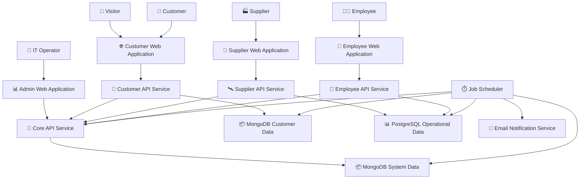

# Astro Bookings: System Architecture

Generated on: Thursday, August 08, 2024

## 1. Software Components

### 🌐 Customer Web Application

- 📋 UI for visitors to view launches, and for customers to make bookings and manage their accounts
- 🧑‍💻 **Angular, TypeScript, HTML, CSS**
- ⬇️ Consumes `🚀 Customer API Service`
- ⬆️ Provides for `👀 Visitor`, `👤 Customer`

### 🏢 Supplier Web Application

- 📋 UI for suppliers to manage rockets, launches, and view bookings
- 🧑‍💻 **Angular, TypeScript, HTML, CSS**
- ⬇️ Consumes `🛰️ Supplier API Service`
- ⬆️ Provides for `🏭 Supplier`

### 💼 Employee Web Application

- 📋 UI for employees to manage bookings, launches, and financial operations
- 🧑‍💻 **Angular, TypeScript, HTML, CSS**
- ⬇️ Consumes `👔 Employee API Service`
- ⬆️ Provides for `👨‍💼 Employee`

### 📊 Admin Web Application

- 📋 UI for IT operators to check system logs and notification status
- 🧑‍💻 **Angular, TypeScript, HTML, CSS**
- ⬇️ Consumes `🔐 Core API Service`
- ⬆️ Provides for `🔧 IT Operator`

### 🚀 Customer API Service

- Handles customer-facing operations (view launches, make bookings)
- Supports public access for visitors to view launches
- 🧑‍💻 **Node.js, Nest.js, TypeScript**
- ⬇️ Consumes `📦 MongoDB (Customer Data)`, `🔐 Core API Service`
- ⬆️ Provides for `🌐 Customer Web Application`

### 🛰️ Supplier API Service

- Handles supplier operations (manage rockets, launches)
- 🧑‍💻 **Node.js, Nest.js, TypeScript**
- ⬇️ Consumes `📊 PostgreSQL (Operational Data)`, `🔐 Core API Service`
- ⬆️ Provides for `🏢 Supplier Web Application`

### 👔 Employee API Service

- Handles employee operations (manage bookings, financial operations)
- 🧑‍💻 **Node.js, Nest.js, TypeScript**
- ⬇️ Consumes `📊 PostgreSQL (Operational Data)`, `🔐 Core API Service`
- ⬆️ Provides for `💼 Employee Web Application`

### 🔐 Core API Service

- Handles user authentication, logging, and core system operations
- 🧑‍💻 **Node.js, Nest.js, TypeScript**
- ⬇️ Consumes `📦 MongoDB (System Data)`
- ⬆️ Provides for all other API Services and `📊 Admin Web Application`

### ⏱️ Job Scheduler

- Handles periodic tasks like sending emails and data reconciliation
- 🧑‍💻 **Node.js, TypeScript**
- ⬇️ Consumes `📊 PostgreSQL (Operational Data)`, `📦 MongoDB (Customer Data)`, `📦 MongoDB (System Data)`, `🔐 Core API Service`

## 2. Database Components

### 📊 PostgreSQL (Operational Data)

- Stores relational data for suppliers, launches, and financial operations
- 🧑‍💻 **PostgreSQL**
- ⬆️ Provides for `🛰️ Supplier API Service`, `👔 Employee API Service`, `⏱️ Job Scheduler`

### 📦 MongoDB (Customer Data)

- Stores non-relational data for customer-facing operations
- 🧑‍💻 **MongoDB**
- ⬆️ Provides for `🚀 Customer API Service`, `⏱️ Job Scheduler`

### 📦 MongoDB (System Data)

- Stores system logs, user credentials, and job queues
- 🧑‍💻 **MongoDB**
- ⬆️ Provides for `🔐 Core API Service`, `⏱️ Job Scheduler`

## 3. External Services

### 📧 Email Notification Service

- Handles sending emails to customers and suppliers
- ⬆️ Provides for `⏱️ Job Scheduler`

## 4. System Architecture Diagram

## 5. Scalability and Deployment Considerations

- Each API service (Customer, Supplier, Employee, Core) can be deployed and scaled independently.
- The Job Scheduler can be deployed as a separate service and scaled as needed.
- Database components (PostgreSQL and MongoDB) should be set up with proper replication and sharding for scalability.
- Consider using containerization (e.g., Docker) and orchestration (e.g., Kubernetes) for easier deployment and scaling.
- Implement a load balancer in front of the web applications and API services to distribute traffic.

## 6. Security Considerations

- Implement SSL/TLS for all communication between components.
- Use JWT or similar token-based authentication for API requests.
- Implement proper access controls and role-based permissions in the Core API Service.
- Encrypt sensitive data at rest in both PostgreSQL and MongoDB databases.
- Regularly update and patch all components to address security vulnerabilities.
- Ensure that the Customer API Service properly distinguishes between public (visitor) and authenticated (customer) access to data and functionality.

