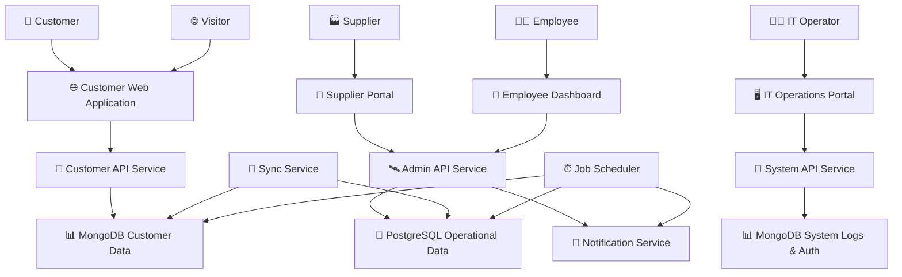

# Astro Bookings: System Architecture

Timestamp: 2024-08-08 10:30:00 UTC

## Software Components

### 🌐 Customer Web Application

- 📋 UI for customers to view launches, book seats, and manage reservations
- 🧑‍💻 **Angular, TypeScript, HTML, CSS**
- ⬇️ Consumes `🚀 Customer API Service`
- ⬆️ Provides for `👤 Customer`, `🌐 Visitor`

### 🏢 Supplier Portal

- 📋 UI for suppliers to manage rockets, launches, and view bookings
- 🧑‍💻 **Angular, TypeScript, HTML, CSS**
- ⬇️ Consumes `🛰️ Admin API Service`
- ⬆️ Provides for `🏭 Supplier`

### 💼 Employee Dashboard

- 📋 UI for employees to monitor bookings, launches, and financial status
- 🧑‍💻 **Angular, TypeScript, HTML, CSS**
- ⬇️ Consumes `🛰️ Admin API Service`
- ⬆️ Provides for `👨‍💼 Employee`

### 🖥️ IT Operations Portal

- 📋 UI for IT staff to monitor system logs and notification status
- 🧑‍💻 **Angular, TypeScript, HTML, CSS**
- ⬇️ Consumes `🔧 System API Service`
- ⬆️ Provides for `👨‍💻 IT Operator`

### 🚀 Customer API Service

- Handles customer-facing operations (view launches, bookings)
- 🧑‍💻 **Node.js, Nest.js, TypeScript**
- ⬇️ Consumes `📊 MongoDB (Customer Data)`
- ⬆️ Provides for `🌐 Customer Web Application`

### 🛰️ Admin API Service

- Handles supplier and employee operations
- 🧑‍💻 **Node.js, Nest.js, TypeScript**
- ⬇️ Consumes `📀 PostgreSQL (Operational Data)`, `📨 Notification Service`
- ⬆️ Provides for `🏢 Supplier Portal`, `💼 Employee Dashboard`

### 🔧 System API Service

- Handles system logs and user authentication
- 🧑‍💻 **Node.js, Nest.js, TypeScript**
- ⬇️ Consumes `📊 MongoDB (System Logs & Auth)`
- ⬆️ Provides for `🖥️ IT Operations Portal`

### 🔄 Sync Service

- Synchronizes data between PostgreSQL and MongoDB
- 🧑‍💻 **Node.js, TypeScript**
- ⬇️ Consumes `📀 PostgreSQL (Operational Data)`, `📊 MongoDB (Customer Data)`

### ⏰ Job Scheduler

- Handles periodic tasks (emails, database reconciliation)
- 🧑‍💻 **Node.js, TypeScript**
- ⬇️ Consumes `📀 PostgreSQL (Operational Data)`, `📊 MongoDB (Customer Data)`, `📨 Notification Service`

## Database Components

### 📀 PostgreSQL (Operational Data)

- Stores relational data (suppliers, rockets, launches, bookings, invoices)
- 🧑‍💻 **PostgreSQL**
- ⬆️ Provides for `🛰️ Admin API Service`, `🔄 Sync Service`, `⏰ Job Scheduler`

### 📊 MongoDB (Customer Data)

- Stores customer-facing data for quick access
- 🧑‍💻 **MongoDB**
- ⬆️ Provides for `🚀 Customer API Service`, `🔄 Sync Service`, `⏰ Job Scheduler`

### 📊 MongoDB (System Logs & Auth)

- Stores system logs, user credentials, and authentication data
- 🧑‍💻 **MongoDB**
- ⬆️ Provides for `🔧 System API Service`

## External Services

### 📨 Notification Service

- Handles email notifications to customers and suppliers
- ⬆️ Provides for `🛰️ Admin API Service`, `⏰ Job Scheduler`

## System Architecture Diagram

This document outlines the high-level system architecture for the Astro Bookings platform. It describes the main components, their interactions, and the technologies used. This architecture is designed to meet the scalability, performance, and security requirements specified in the formal requirements document.
