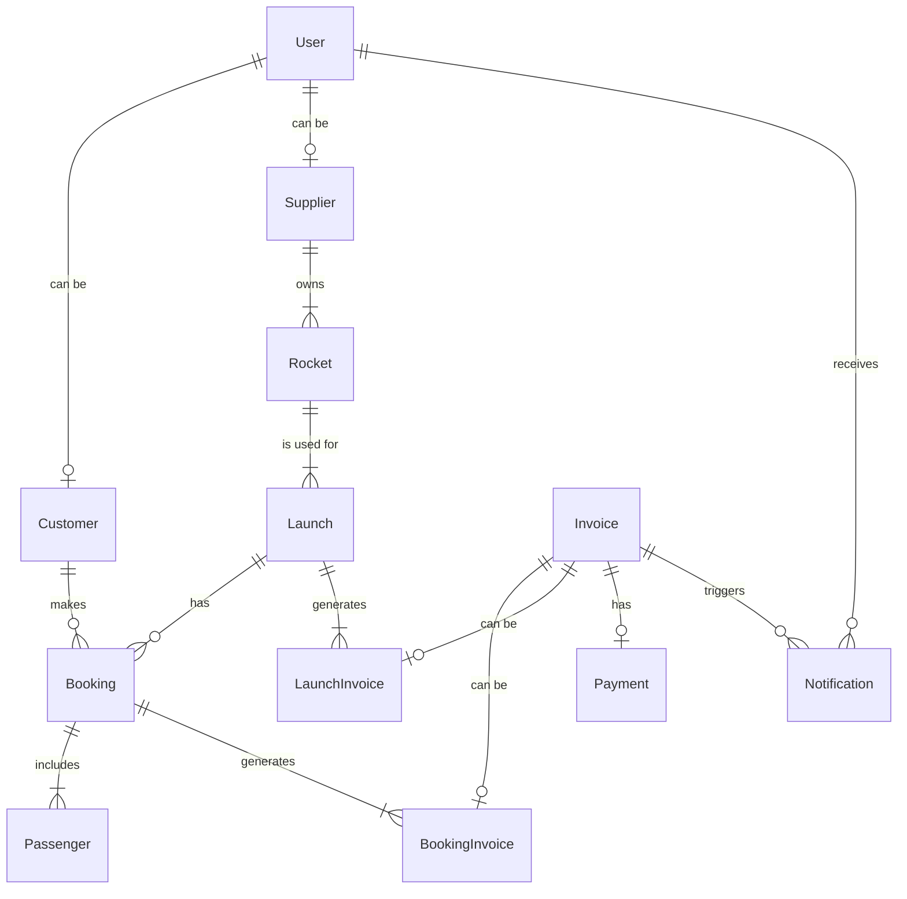

# Astro Bookings: Complete Domain Model

> Timestamp: 06/08/2024 13:15

## User

Description: A registered individual on the Astro Bookings platform.

- **id**: Unique identifier `UUID`
- **name**: User's full name `String`
- **email**: User's email address `String`
- **password**: Hashed password `String`
- **role**: User's role in the system `String` [Customer, Supplier, Employee]

## Customer

Description: A user who books space travel.

- **userId**: Reference to User entity `UUID`
- **taxId**: Tax identification number `String`
- **legalAddress**: Legal address for invoicing `String`
- _isVIP_: Whether the customer is a VIP `Boolean`

## Supplier

Description: A company that provides rocket launches.

- **userId**: Reference to User entity `UUID`
- **companyName**: Name of the supplier company `String`
- **taxId**: Tax identification number `String`
- **legalAddress**: Legal address of the company `String`

## Rocket

Description: A spacecraft capable of carrying passengers.

- **id**: Unique identifier `UUID`
- **supplierId**: Reference to Supplier entity `UUID`
- **name**: Name of the rocket `String`
- **model**: Model or version of the rocket `String`
- **capacity**: Maximum number of passengers `Integer`
- **range**: Maximum travel range `String` [LEO, Moon, Mars]
- description: Detailed description of the rocket `Text`
- imageUrl: URL to an image of the rocket `String`

## Launch

Description: A scheduled trip to space using a specific rocket.

- **id**: Unique identifier `UUID`
- **rocketId**: Reference to Rocket entity `UUID`
- **departureDate**: Scheduled departure date and time `DateTime`
- **destination**: Destination of the launch `String`
- **spaceport**: Departure location `String`
- **status**: Current status of the launch `String` [Scheduled, Delayed, Cancelled, Completed]
- **pricePerSeat**: Price per seat for this launch `Decimal`
- _availableSeats_: Number of seats still available `Integer`
- description: Additional details about the launch `Text`

## Booking

Description: A reservation made by a customer for a specific launch.

- **id**: Unique identifier `UUID`
- **customerId**: Reference to Customer entity `UUID`
- **launchId**: Reference to Launch entity `UUID`
- **bookingDate**: Date when the booking was made `DateTime`
- **status**: Current status of the booking `String` [Confirmed, Cancelled, Completed]
- **seatCount**: Number of seats booked `Integer`
- _totalPrice_: Total price for the booking `Decimal`
- specialRequests: Any special requests or notes `Text`

## Passenger

Description: A person who will travel on a booked launch.

- **id**: Unique identifier `UUID`
- **bookingId**: Reference to Booking entity `UUID`
- **firstName**: Passenger's first name `String`
- **lastName**: Passenger's last name `String`
- **dateOfBirth**: Passenger's date of birth `Date`
- _age_: Calculated age of the passenger at the time of booking `Integer` (18-70)
- **nationality**: Passenger's nationality `String`
- **passportNumber**: Passenger's passport number `String`
- email: Passenger's email address `String`
- phoneNumber: Passenger's phone number `String`
- emergencyContact: Emergency contact information `Text`
- medicalNotes: Relevant medical information `Text`

## Invoice

Description: A generalized entity for bills, containing common legal information.

- **id**: Unique identifier `UUID`
- **number**: Invoice number for legal purposes `String`
- **issueDate**: Date when the invoice was issued `Date`
- **dueDate**: Date when the payment is due `Date`
- **totalAmount**: Total amount of the invoice `Decimal`
- **status**: Current status of the invoice `String` [Pending, Paid, Overdue, Cancelled]
- **type**: Type of the invoice `String` [Charge, Refund]
- notes: Additional notes or terms `Text`

## BookingInvoice

Description: A specialized invoice entity for customer bookings, including charges and potential refunds.

- **invoiceId**: Reference to Invoice entity `UUID`
- **bookingId**: Reference to Booking entity `UUID`
- **customerId**: Reference to Customer entity `UUID`

## LaunchInvoice

Description: A specialized invoice entity for supplier launches, including charges and potential received invoices.

- **invoiceId**: Reference to Invoice entity `UUID`
- **launchId**: Reference to Launch entity `UUID`
- **supplierId**: Reference to Supplier entity `UUID`

## Payment

Description: A record of financial transactions related to invoices.

- **id**: Unique identifier `UUID`
- **invoiceId**: Reference to Invoice entity `UUID`
- **amount**: Amount paid `Decimal`
- **paymentDate**: Date when the payment was made `DateTime`
- **method**: Payment method used `String` [CreditCard, BankTransfer, PayPal]
- **status**: Status of the payment `String` [Pending, Completed, Failed]
- transactionId: ID from the payment processor `String`

## Notification

Description: A message sent to users about various events in the system.

- **id**: Unique identifier `UUID`
- **userId**: Reference to User entity `UUID`
- **type**: Type of notification `String` [Booking, Payment, Launch, System]
- **message**: Content of the notification `Text`
- **createdAt**: Timestamp when the notification was created `DateTime`
- **status**: Status of the notification delivery `String` [Pending, Sent, Failed]
- **relatedEntityType**: Type of entity this notification is about `String` [Booking, Launch, Invoice, Payment]
- **relatedEntityId**: ID of the related entity `UUID`

## LogEntry

Description: A record of system events and actions for monitoring and debugging purposes.

- **id**: Unique identifier `UUID`
- **timestamp**: Date and time when the log entry was created `DateTime`
- **level**: Severity level of the log entry `String` [Info, Warning, Error, Critical]
- **message**: Detailed description of the event or action `Text`
- source: Origin of the log entry (e.g., component or module name) `String`
- relatedEntityType: Type of entity this log entry is about, if applicable `String` [User, Customer, Supplier, Rocket, Launch, Booking, Invoice, Payment, Notification]
- relatedEntityId: ID of the related entity, if applicable `UUID`
- stackTrace: Technical details for error tracking, if applicable `Text`
- additionalData: Any extra information in JSON format `JSON`

## Mermaid diagram code

