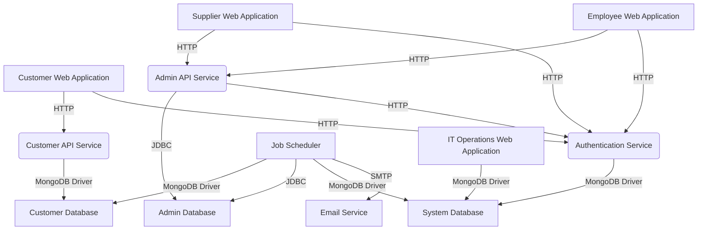

# AstroBookings System Architecture

## Components

### Customer-facing

- `Customer Web Application`:
  - Description: Web application for customers to browse launches and make bookings
  - Type: Web application
  - Technology: Angular

- `Customer API Service`:
  - Description: API service for customer operations
  - Type: API Service
  - Technology: NestJS

- `Customer Database`:
  - Description: NoSQL database for customer data
  - Type: Database
  - Technology: MongoDB

### Supplier-facing

- `Supplier Web Application`:
  - Description: Web application for suppliers to manage rockets and launches
  - Type: Web application
  - Technology: Angular

- `Admin API Service`:
  - Description: API service for supplier and employee operations
  - Type: API Service
  - Technology: NestJS

- `Admin Database`:
  - Description: Relational database for supplier and employee data
  - Type: Database
  - Technology: PostgreSQL

### Employee-facing

- `Employee Web Application`:
  - Description: Web application for financial and IT employees
  - Type: Web application
  - Technology: Angular

### Core System

- `Authentication Service`:
  - Description: Handles user authentication and authorization
  - Type: API Service
  - Technology: NestJS

- `System Database`:
  - Description: Database for core system information
  - Type: Database
  - Technology: MongoDB

- `IT Operations Web Application`:
  - Description: Web application for IT operators to monitor system
  - Type: Web application
  - Technology: Angular

### Background Services

- `Job Scheduler`:
  - Description: Manages background tasks like email sending and database synchronization
  - Type: Job
  - Technology: Node.js

- `Email Service`:
  - Description: Handles email notifications
  - Type: External Service
  - Technology: SMTP Server

## Interfaces

- `Customer Web Application` _interfaces with_ `Customer API Service`:
  - Description: RESTful API for customer operations

- `Customer API Service` _interfaces with_ `Customer Database`:
  - Description: MongoDB driver for data access

- `Supplier Web Application` _interfaces with_ `Admin API Service`:
  - Description: RESTful API for supplier operations

- `Employee Web Application` _interfaces with_ `Admin API Service`:
  - Description: RESTful API for employee operations

- `Admin API Service` _interfaces with_ `Admin Database`:
  - Description: JDBC connection for data access

- `Authentication Service` _interfaces with_ `System Database`:
  - Description: MongoDB driver for user data access

- `Job Scheduler` _interfaces with_ `Customer Database`, `Admin Database`, and `System Database`:
  - Description: Database connections for data synchronization

- `Job Scheduler` _interfaces with_ `Email Service`:
  - Description: SMTP protocol for sending emails

- `IT Operations Web Application` _interfaces with_ `System Database`:
  - Description: MongoDB driver for accessing system logs and metrics

## System Architecture diagram

## Additional Notes

1. **Scalability**: The system is designed to allow independent scaling of customer operations and supplier/employee operations. Each component can be run on multiple concurrent processes as needed.

2. **Security**: All components use HTTPS for communication. The Authentication Service manages user authentication and authorization for all applications.

3. **Reliability**: Each component generates logs that are stored in the System Database for monitoring and troubleshooting. The Job Scheduler ensures data consistency across databases and manages asynchronous tasks like email notifications.

4. **Development**: The system uses a Git repository for version control, allowing traceability of code changes and functional evolution.

5. **Testing**: 
   - Unit tests: Jest for business logic in both frontend and backend
   - Integration tests: Cypress for API services
   - End-to-end tests: Cypress for web applications

6. **Deployment**: The system is set up for continuous integration and deployment (CI/CD), with automatic transitions to production for code that passes all tests.

This architecture provides a robust, scalable, and maintainable solution for the AstroBookings system, addressing the requirements for separate customer and supplier operations, security, reliability, and future growth.
